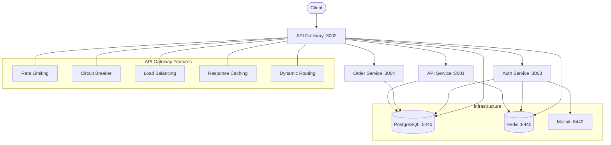
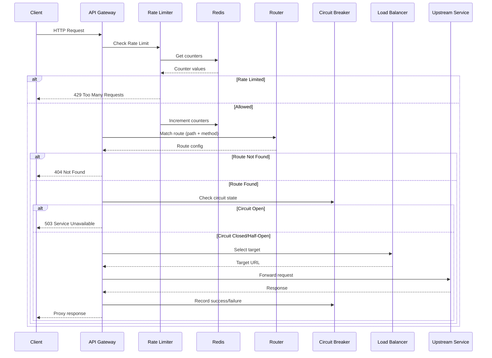

# API Gateway Microservices

A microservices architecture built with NestJS, featuring an API Gateway with dynamic routing, rate limiting, circuit breaker, load balancing, and caching.

## Tech Stack

- **Frontend:** Next.js 15 (App Router), Tailwind CSS, shadcn/ui
- **Backend:** NestJS (multiple microservices)
- **Database:** PostgreSQL + TypeORM
- **Cache:** Redis
- **Monorepo:** Turborepo + pnpm
- **Email (Dev):** Mailpit

## Architecture



## Request Flow



## Project Structure

```
apps/
  ├── web/              # Next.js frontend (port 3000)
  ├── api/              # NestJS API service (port 3001)
  ├── api-gateway/      # API Gateway (port 3002)
  ├── auth-service/     # Authentication service (port 3003)
  └── order-service/    # Order service (port 3004)
packages/
  ├── ui/               # Shared React components (shadcn/ui)
  ├── eslint-config/
  └── typescript-config/
docker/
  └── docker-compose.yml
```

## Quick Start

### 1. Prerequisites

- Node.js >= 18
- pnpm
- Docker

### 2. Install Dependencies

```bash
pnpm install
```

### 3. Start Infrastructure

```bash
docker compose -f docker/docker-compose.yml up -d
```

This starts:
| Service    | Port  | Description            |
|------------|-------|------------------------|
| PostgreSQL | 5440  | Database               |
| Redis      | 6440  | Cache & rate limiting  |
| Mailpit    | 8440  | Email testing Web UI   |
| Mailpit    | 1440  | SMTP server            |

### 4. Environment Setup

Each service needs a `.env` or `.env.local` file. Example for `apps/api-gateway/.env`:

```env
# Server
PORT=3002

# Database
DB_HOST=localhost
DB_PORT=5440
DB_USERNAME=postgres
DB_PASSWORD=postgres
DB_DATABASE=turbo-app-template-db
DB_SCHEMA=gateway

# Redis
REDIS_HOST=localhost
REDIS_PORT=6440
```

### 5. Run Migrations

```bash
# Run migrations for each service
pnpm --filter api-gateway migration:run
pnpm --filter auth-service migration:run
```

### 6. Seed Data (Optional)

```bash
# Seed rate limit rules for API Gateway
pnpm --filter api-gateway seed
```

### 7. Run Development

```bash
# Run all apps
pnpm turbo dev

# Run only backend services (without frontend)
pnpm dev:services
```

| App          | URL                     |
|--------------|-------------------------|
| Web          | http://localhost:3000    |
| API          | http://localhost:3001    |
| API Gateway  | http://localhost:3002    |
| Auth Service | http://localhost:3003    |
| Order Service| http://localhost:3004    |

## Commands

| Command | Description |
|---------|-------------|
| `pnpm turbo dev` | Run all apps in development mode |
| `pnpm dev:services` | Run backend services only |
| `pnpm turbo build` | Build all apps |
| `pnpm turbo lint` | Run linting |
| `pnpm turbo check-types` | TypeScript type checking |
| `pnpm format` | Format code with Prettier |
| `pnpm --filter <app> migration:run` | Run database migrations |
| `pnpm --filter <app> seed` | Run database seeds |

### Testing

```bash
pnpm --filter <app> test          # Unit tests
pnpm --filter <app> test:watch    # Watch mode
pnpm --filter <app> test:e2e      # E2E tests
pnpm --filter <app> test:cov      # Coverage report
```
