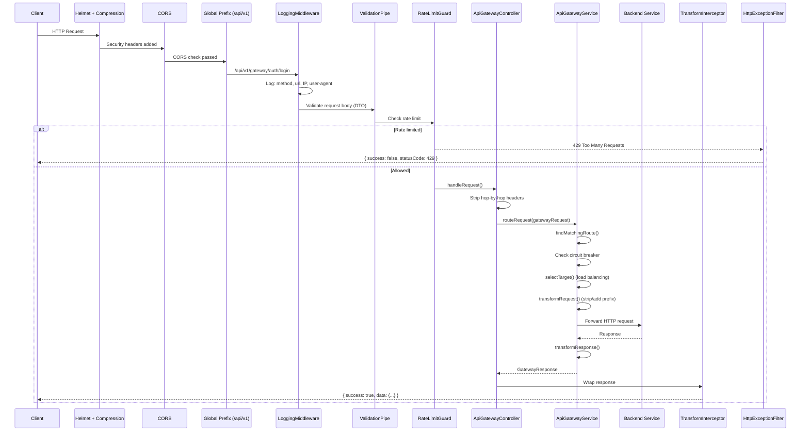
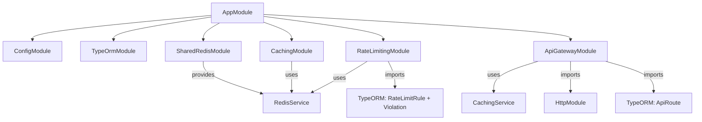
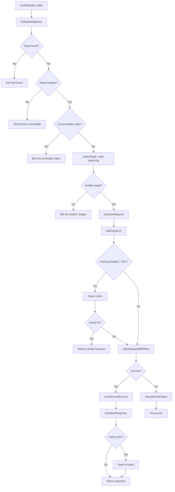
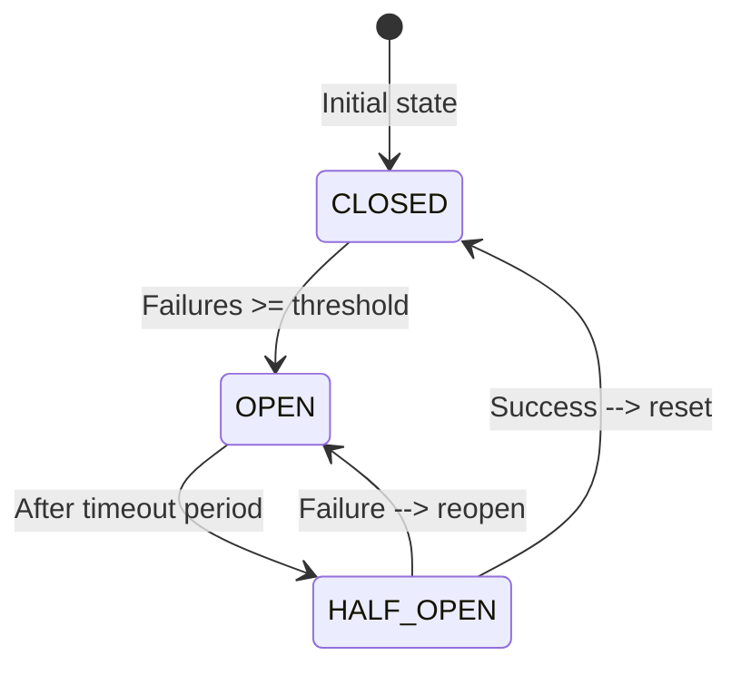
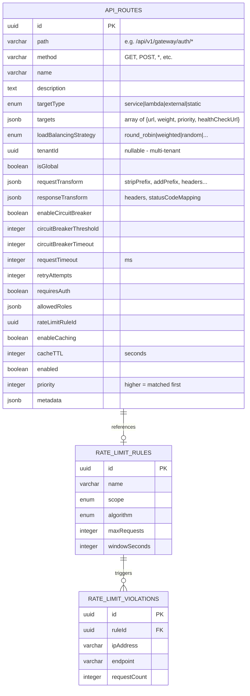

# Technical Design Document: API Gateway Service

## 1. Overview

An API Gateway is the single entry point for all client requests in a microservices architecture. Instead of clients calling each service directly, they call the gateway, which routes requests to the correct backend service.

**Without gateway:**
```
Client --> Auth Service (:3003)
Client --> User Service (:3001)
Client --> Payment Service (:3004)
```

**With gateway:**
```
Client --> API Gateway (:3001) --> Auth Service (:3003)
                                --> User Service (:3002)
                                --> Payment Service (:3004)
```

This project's API Gateway is a NestJS 11 service with dynamic routing, load balancing, circuit breaker, request/response transformation, caching, and rate limiting -- all configurable via database (not hardcoded).

**Source location:** `apps/api-gateway/`

## 2. Architecture

### 2.1 Directory Structure

```
apps/api-gateway/src/
+-- main.ts                                    # App bootstrap + security + Swagger
+-- app.module.ts                              # Root module wiring
+-- app.controller.ts                          # Health check endpoint
+-- app.service.ts                             # Health check logic
|
+-- config/
|   +-- database.config.ts                     # PostgreSQL config from env
|   +-- redis.config.ts                        # Redis config from env
|
+-- database/
|   +-- data-source.ts                         # TypeORM CLI data source
|   +-- seeds/run-seed.ts                      # Database seeding
|
+-- modules/
|   +-- api-gateway/
|       +-- api-gateway.module.ts              # Feature module (TypeORM + HttpModule)
|       +-- api-gateway.controller.ts          # Route CRUD + catch-all proxy
|       +-- api-gateway.service.ts             # Core routing logic
|       +-- entities/
|       |   +-- api-route.entity.ts            # Route definition entity
|       +-- dto/
|           +-- create-route.dto.ts            # Route creation validation
|           +-- update-route.dto.ts            # Route update validation
|           +-- route-target.dto.ts            # Target URL config
|           +-- index.ts                       # DTO barrel export
|
+-- shared/
    +-- redis/
    |   +-- shared-redis.module.ts             # Global Redis connection (singleton)
    +-- caching/
    |   +-- caching.module.ts                  # Caching service module
    |   +-- caching.service.ts                 # Redis cache with 6 strategies
    |   +-- decorators/cacheable.decorator.ts  # @Cacheable, @CacheInvalidate
    |   +-- interceptors/cache.interceptor.ts  # Auto-cache interceptor
    +-- rate-limiting/
    |   +-- rate-limiting.module.ts            # Rate limiting module
    |   +-- rate-limiting.service.ts           # 4 algorithms (Token Bucket, etc.)
    |   +-- rate-limiting.controller.ts        # Admin API for rules
    |   +-- guards/rate-limit.guard.ts         # Auto rate limit guard
    |   +-- decorators/rate-limit.decorator.ts # @RateLimit, @SkipRateLimit
    |   +-- entities/rate-limit-rule.entity.ts
    |   +-- entities/rate-limit-violation.entity.ts
    |   +-- dto/create-rate-limit-rule.dto.ts
    +-- filters/
    |   +-- http-exception.filter.ts           # Global error formatting
    +-- interceptors/
    |   +-- transform.interceptor.ts           # Global response wrapping
    +-- middleware/
    |   +-- logging.middleware.ts              # Request logging
    +-- pipes/
        +-- validation.pipe.ts                 # DTO validation
```

### 2.2 Request Lifecycle



### 2.3 Module Dependency Graph



## 3. Theory: What Does an API Gateway Do?

### 3.1 Core Responsibilities

| Responsibility | What it means | Analogy |
|---------------|--------------|---------|
| **Routing** | Direct request to correct service | Airport traffic control directing planes to runways |
| **Load Balancing** | Distribute load across multiple instances | Bank with multiple tellers -- send customers to least busy |
| **Circuit Breaker** | Stop calling failing services | Electrical fuse -- cut power before damage spreads |
| **Rate Limiting** | Prevent abuse | Bouncer at a club -- max capacity enforced |
| **Caching** | Return cached responses | Receptionist with notes -- answer without calling the office |
| **Request Transform** | Modify request before forwarding | Translator at a conference |
| **Response Transform** | Modify response before returning | Editor reviewing before publishing |
| **Auth & Security** | Verify credentials before routing | Security checkpoint at building entrance |

### 3.2 Why Not Call Services Directly?

```
Without Gateway:                    With Gateway:
+--------+                          +--------+
| Client |-->Auth:3003              | Client |-->Gateway:3001
|        |-->Users:3002             |        |     +-->Auth:3003
|        |-->Payment:3004           +--------+     +-->Users:3002
|        |-->Notification:3005                     +-->Payment:3004
+--------+                                         +-->Notification:3005

Problems:                           Solutions:
- Client knows all service URLs     - Single URL for everything
- No central rate limiting          - Central rate limit + auth
- No circuit breaking               - Circuit breaker per route
- Hard to add/remove services       - Change DB route, zero downtime
- Duplicate auth in every service   - Auth once at gateway
```

### 3.3 API Gateway Patterns

There are several common patterns for how API gateways are used in production:

#### Edge Gateway (This Project)

The gateway sits at the edge of your network. All external traffic enters through it.

```
Internet --> Edge Gateway --> [Service A, Service B, Service C]
```

**Pros:** Single point of control, centralized security, simple for clients.
**Cons:** Single point of failure if not replicated, potential bottleneck.

#### Backend-for-Frontend (BFF)

One gateway per client type (web, mobile, IoT). Each gateway tailors the API for its client.

```
Web App    --> Web Gateway    --> [Service A, B]
Mobile App --> Mobile Gateway --> [Service A, C]
IoT Device --> IoT Gateway    --> [Service D]
```

**Pros:** Each client gets an optimized API (e.g., mobile gets less data, web gets full objects).
**Cons:** More gateways to maintain, code duplication between gateways.

#### Mesh Gateway (Service Mesh Sidecar)

Every service has its own small proxy (sidecar). No centralized gateway -- each service handles its own routing, retries, circuit breaking.

```
Service A + Sidecar Proxy <--> Service B + Sidecar Proxy
```

**Pros:** No single point of failure, per-service control.
**Cons:** Complex to set up, high resource overhead (one proxy per service).

**Tools:** Istio, Linkerd, Envoy.

### 3.4 Comparison with Production API Gateways

| Feature | This Project | Kong | Nginx | AWS API Gateway | Spring Cloud Gateway |
|---------|-------------|------|-------|----------------|---------------------|
| **Language** | TypeScript/NestJS | Lua/C (OpenResty) | C | Managed Service | Java/Spring |
| **Routing** | DB-driven, dynamic | DB-driven, dynamic | Config file, static | Console/API | Config/Code |
| **Load Balancing** | 5 strategies (in-app) | 4 strategies (nginx) | 5+ strategies (native) | Auto (AWS internal) | Ribbon/Spring LB |
| **Circuit Breaker** | In-memory Map | Kong plugin | Not built-in | Not built-in | Resilience4j |
| **Rate Limiting** | Redis-backed, 4 algo | Redis/local plugin | ngx_http_limit_req | Token bucket (AWS) | Redis-backed |
| **Caching** | Redis, 6 strategies | Redis/memory plugin | proxy_cache | CloudFront integration | Spring Cache |
| **Auth** | Planned (JWT) | JWT/OAuth2 plugins | nginx-jwt module | Cognito/Lambda auth | Spring Security |
| **Config** | PostgreSQL | PostgreSQL/Cassandra | nginx.conf files | AWS Console/CloudFormation | YAML/Java code |
| **Performance** | ~5k req/s (Node) | ~30k req/s | ~50k+ req/s | Auto-scales | ~10k req/s |
| **Best for** | Learning, small projects | Production, plugins ecosystem | High performance, static | Serverless, AWS ecosystem | Spring ecosystem |

**Key takeaways:**
- Kong and Nginx are battle-tested for production with tens of thousands of requests/second.
- This project implements the same patterns (routing, circuit breaker, rate limiting, caching) but in TypeScript/NestJS -- great for understanding how gateways work internally.
- AWS API Gateway is fully managed -- zero infrastructure, but locked to AWS.
- Spring Cloud Gateway is the Java equivalent, using the same patterns (route predicates, filters, circuit breaker).

### 3.5 Anti-Patterns to Avoid

#### God Gateway

**Problem:** The gateway does too much -- business logic, data transformation, aggregation, database queries.

```
BAD: Client --> Gateway (validate order, check inventory, calculate price, call payment) --> DB
GOOD: Client --> Gateway (route + auth) --> Order Service (business logic) --> DB
```

**Rule:** The gateway should route, not think. Business logic belongs in services.

#### No Circuit Breaking

**Problem:** One failing service causes all requests to pile up, starving other services.

```
BAD:  Gateway --> Auth (down, 30s timeout) x 1000 requests = 30,000s blocked
GOOD: Gateway --> Auth (down, 5 failures) --> circuit OPEN --> instant 503
```

#### Single Point of Failure

**Problem:** One gateway instance = if it crashes, everything is down.

```
BAD:  Client --> Gateway (single) --> Services
GOOD: Client --> Load Balancer --> [Gateway 1, Gateway 2, Gateway 3] --> Services
```

In production, always run multiple gateway instances behind a load balancer (AWS ALB, Nginx, HAProxy).

#### Tight Coupling

**Problem:** Gateway knows too much about service internals (specific endpoint structures, response formats).

```
BAD:  Gateway hardcodes: if (path === '/users/123') { callUserService.getUser(123) }
GOOD: Gateway matches wildcard: /api/v1/gateway/users/* --> User Service
```

### 3.6 Best Practices

| Practice | Why | This project |
|----------|-----|-------------|
| Keep gateway thin | Route, don't think. Business logic in services | Yes -- gateway only routes |
| Fail fast | Circuit breaker + timeouts prevent cascading failure | Yes -- circuit breaker + retry |
| Health checks | Know which targets are alive | Partial -- endpoint exists but returns `true` always |
| Observability | Log every request, track metrics | Yes -- LoggingMiddleware + X-Gateway-Duration |
| Dynamic config | Change routing without deploy | Yes -- routes in PostgreSQL |
| Idempotent retries | Only retry safe operations (GET) or with idempotency keys | No -- retries all methods |
| Rate limiting at edge | Block abuse before it reaches services | Yes -- global RateLimitGuard |
| Request ID propagation | Track request across services | No -- not implemented yet |

## 4. Routing System

### 4.1 How Route Matching Works

When a request arrives at `@All('*path')`, the gateway:

1. **Gets all routes** from DB (ordered by `priority` DESC)
2. **Matches path** using regex (supports `*` wildcard)
3. **Matches method** (exact or `*` for any)
4. **First match wins** (higher priority routes checked first)

```typescript
// Route in DB: { path: "/api/v1/gateway/auth/*", method: "*", priority: 10 }
// Request:     POST /api/v1/gateway/auth/login

// path pattern: /api/v1/gateway/auth/* --> regex: /^\/api\/v1\/gateway\/auth\/.*$/
// match: "/api/v1/gateway/auth/login".match(regex) --> true
// method: "*" matches "POST" --> true
```

### 4.2 Request Transformation Pipeline

```
Original path:    /api/v1/gateway/auth/login
                           |
stripPrefix="/api/v1/gateway"
                           |
                  /auth/login
                           |
addPrefix="/api/v1"
                           |
                  /api/v1/auth/login
                           |
buildTargetUrl("http://localhost:3003")
                           |
         http://localhost:3003/api/v1/auth/login
```

Headers can also be transformed:

```json
{
  "requestTransform": {
    "stripPrefix": "/api/v1/gateway",
    "addPrefix": "/api/v1",
    "addHeaders": { "X-Forwarded-By": "api-gateway" },
    "removeHeaders": ["X-Internal-Token"]
  },
  "responseTransform": {
    "addHeaders": { "X-Gateway": "true" },
    "removeHeaders": ["X-Internal-Debug"],
    "statusCodeMapping": { "502": 503 }
  }
}
```

### 4.3 Hop-by-Hop Header Stripping

The controller strips these headers before forwarding (to prevent the "request aborted" error):

```
content-length    --> axios recalculates from serialized body
host              --> axios sets to target host
transfer-encoding --> not applicable for new request
connection        --> managed per-hop
keep-alive        --> managed per-hop
upgrade, expect, te --> protocol-specific, not forwarded
```

All other headers (Authorization, Content-Type, custom headers) are forwarded unchanged.

## 5. Deep Dive: Source Code Analysis

### 5.1 Bootstrap (`main.ts`)

The `bootstrap()` function configures the entire application before starting the HTTP server. Order matters -- each layer builds on the previous one.

```typescript
async function bootstrap() {
  // 1. Create NestJS app with Express platform
  const app = await NestFactory.create<NestExpressApplication>(AppModule, {
    logger: ['error', 'warn', 'log', 'debug', 'verbose'],
  });
```

**Line by line:**
- `NestExpressApplication` -- uses Express under the hood (not Fastify). This gives access to Express-specific features like `req.ip`, `req.path`.
- `logger: [...]` -- enables all 5 log levels. In production you'd typically disable `debug` and `verbose`.

```typescript
  // 2. Global prefix -- all routes start with /api/v1
  app.setGlobalPrefix(apiPrefix);  // apiPrefix = "api/v1"
```

This means `@Controller('gateway')` becomes `/api/v1/gateway`. Every controller in the app gets this prefix automatically.

```typescript
  // 3. Security middleware (runs for EVERY request, before NestJS processing)
  app.use(helmet());       // Sets 15+ security HTTP headers
  app.use(compression());  // Gzip compresses response bodies (saves bandwidth)
```

`helmet()` adds headers like:
- `X-Content-Type-Options: nosniff` -- prevents MIME-type sniffing
- `X-Frame-Options: SAMEORIGIN` -- prevents clickjacking
- `Strict-Transport-Security` -- forces HTTPS

`compression()` compresses responses > 1KB by default. A 50KB JSON response becomes ~5KB over the wire.

```typescript
  // 4. CORS -- controls which domains can call this API
  app.enableCors({
    origin: corsOrigins,           // ['*'] or ['http://localhost:3000']
    credentials: true,             // Allow cookies/auth headers
    methods: ['GET', 'POST', 'PUT', 'PATCH', 'DELETE', 'OPTIONS'],
    allowedHeaders: ['Content-Type', 'Authorization'],
  });
```

**Why `credentials: true`?** Without this, browsers won't send cookies or Authorization headers in cross-origin requests.

```typescript
  // 5. Global validation pipe
  app.useGlobalPipes(new ValidationPipe({
    whitelist: true,               // Strip properties not in DTO
    forbidNonWhitelisted: true,    // Throw error if unknown property sent
    transform: true,               // Auto-convert types (string "5" --> number 5)
    transformOptions: {
      enableImplicitConversion: true,  // Enable implicit type conversion
    },
  }));
```

**`whitelist + forbidNonWhitelisted`** together mean: if the DTO has `name` and `email`, and the client sends `{ name, email, isAdmin: true }`, NestJS rejects the request with 400. This prevents mass-assignment attacks.

```typescript
  // 6. Global exception filter and response interceptor
  app.useGlobalFilters(new HttpExceptionFilter());
  app.useGlobalInterceptors(new TransformInterceptor());
```

These two work together:
- `HttpExceptionFilter` catches errors and formats them as `{ success: false, statusCode, error, message, path, timestamp }`
- `TransformInterceptor` wraps success responses as `{ success: true, statusCode, data, timestamp }`

**Execution order:**
```
Request --> Interceptor (before) --> Controller --> Interceptor (after: wrap response)
                                                --> Filter (only if error thrown)
```

### 5.2 Controller: `handleRequest()` (`api-gateway.controller.ts:104-156`)

This is the catch-all proxy endpoint. Every request that doesn't match a CRUD route (`/routes`, `/routes/:id`) lands here.

```typescript
@All('*path')
async handleRequest(
  @Req() req: Request,
  @Res({ passthrough: true }) res: Response,
) {
```

**`@All('*path')`** -- matches ANY HTTP method (GET, POST, PUT, PATCH, DELETE) and ANY path after `/api/v1/gateway/`. The `*path` is a NestJS wildcard parameter.

**`@Res({ passthrough: true })`** -- allows modifying the response object (setting headers, status code) while still letting NestJS handle the return value. Without `passthrough: true`, returning a value from the method would be ignored.

**Why CRUD routes are declared BEFORE `@All('*path')`:**

```typescript
// These are declared first in the controller:
@Get('routes')          // matches /api/v1/gateway/routes
@Get('routes/:id')      // matches /api/v1/gateway/routes/abc123
@Post('routes')         // matches /api/v1/gateway/routes
@Patch('routes/:id')    // matches /api/v1/gateway/routes/abc123
@Delete('routes/:id')   // matches /api/v1/gateway/routes/abc123

// This is declared LAST:
@All('*path')           // matches /api/v1/gateway/* (everything else)
```

NestJS matches routes in declaration order. If `@All('*path')` were first, it would intercept `GET /api/v1/gateway/routes` and try to proxy it to a backend service instead of returning the route list.

**Hop-by-hop header stripping:**

```typescript
const HOP_BY_HOP_HEADERS = new Set([
  'content-length', 'transfer-encoding', 'connection',
  'keep-alive', 'host', 'upgrade', 'expect', 'te',
]);

const forwardHeaders: Record<string, string> = {};
for (const [key, value] of Object.entries(req.headers)) {
  if (!HOP_BY_HOP_HEADERS.has(key.toLowerCase()) && typeof value === 'string') {
    forwardHeaders[key] = value;
  }
}
```

**Why this is necessary:**

When Express parses the incoming request, it reads the body and sets `content-length: 42` (the raw byte size). But when axios sends the request to the backend, it re-serializes `req.body` (a parsed JS object) back to JSON. The re-serialized JSON may have a different byte length (e.g., `43` bytes due to whitespace differences). If we forward the original `content-length: 42`, the backend reads 42 bytes, then the stream is still open with 1 byte remaining -- causing `"request aborted"`.

**`typeof value === 'string'` check:** Express headers can be `string | string[] | undefined`. For example, `set-cookie` can be an array. We only forward string-valued headers; arrays would need to be joined or handled separately.

**Building the gatewayRequest:**

```typescript
const gatewayRequest = {
  path: req.path,       // e.g., "/api/v1/gateway/auth/login"
  method: req.method,   // e.g., "POST"
  headers: forwardHeaders,
  query: req.query as Record<string, string>,
  body: req.body,       // parsed by Express JSON middleware
  tenantId: (req as any).user?.tenantId,  // from JWT (when auth is implemented)
  userId: (req as any).user?.id,
};
```

**Setting response headers:**

```typescript
const response = await this.gatewayService.routeRequest(gatewayRequest);

// Forward response headers from backend to client
Object.entries(response.headers).forEach(([key, value]) => {
  res.setHeader(key, value);
});

// Add gateway-specific headers (debugging/monitoring)
res.setHeader('X-Gateway-Target', response.targetUrl);   // which backend was called
res.setHeader('X-Gateway-Duration', response.duration.toString()); // how long it took

res.status(response.status);  // forward the backend's status code (200, 201, 404, etc.)
return response.body;  // NestJS serializes this to JSON
```

### 5.3 Service: `routeRequest()` (`api-gateway.service.ts:68-183`)

This is the main orchestration method. It coordinates all gateway features in sequence.



**Step by step:**

```typescript
async routeRequest(request: GatewayRequest): Promise<GatewayResponse> {
  const startTime = Date.now();  // start timer for duration measurement
```

**Step 1: Find matching route**
```typescript
  const route = await this.findMatchingRoute(request);
  if (!route) {
    throw new HttpException('No route found for this request', HttpStatus.NOT_FOUND);
  }
  if (!route.enabled) {
    throw new HttpException('This route is disabled', HttpStatus.SERVICE_UNAVAILABLE);
  }
```

Routes can be disabled via `PATCH /routes/:id { "enabled": false }` for maintenance without deleting them.

**Step 2: Circuit breaker check**
```typescript
  if (route.enableCircuitBreaker && this.isCircuitOpen(route.id)) {
    throw new HttpException(
      'Service temporarily unavailable (circuit breaker open)',
      HttpStatus.SERVICE_UNAVAILABLE,
    );
  }
```

If the circuit is OPEN, we don't even try to call the backend -- instant 503. This protects the system from cascading timeouts.

**Step 3: Load balancing -- select target**
```typescript
  const target = this.selectTarget(route);
  if (!target) {
    throw new HttpException('No healthy targets available', HttpStatus.SERVICE_UNAVAILABLE);
  }
```

**Step 4: Transform + build URL + optional cache check**
```typescript
  const transformedRequest = this.transformRequest(request, route);
  const targetUrl = this.buildTargetUrl(target.url, transformedRequest);

  if (route.enableCaching && request.method === 'GET') {
    const cached = await this.getCachedResponse(targetUrl);
    if (cached) return { ...cached, targetUrl, duration: Date.now() - startTime };
  }
```

Only GET requests are cached because GET is idempotent (same request = same response). POST/PATCH/DELETE have side effects.

**Step 5: Make the actual HTTP call**
```typescript
  const response = await this.makeRequestWithRetry(
    targetUrl, transformedRequest, route.retryAttempts, route.requestTimeout,
  );
```

**Step 6: Record success + transform response + cache**
```typescript
  this.recordCircuitSuccess(route.id);  // reset failure count
  const transformedResponse = this.transformResponse(response, route);

  if (route.enableCaching && request.method === 'GET') {
    await this.cacheResponse(targetUrl, transformedResponse, route.cacheTTL);
  }
```

**Step 7: Error handling**
```typescript
  } catch (error) {
    this.recordCircuitFailure(route.id, route);  // increment failure count

    if (error instanceof HttpException) throw error;  // re-throw our own errors

    if (error instanceof AxiosError) {
      // Backend returned an error (e.g., 400 Bad Request from auth service)
      throw new HttpException(
        error.response?.data || error.message,
        error.response?.status || HttpStatus.BAD_GATEWAY,  // 502 if no response at all
      );
    }

    throw new HttpException(message, HttpStatus.BAD_GATEWAY);
  }
```

**Important:** `AxiosError` can have `error.response` (backend responded with error status) or not (network error, timeout). When `error.response` is `undefined`, it means the backend never responded, so we return 502 Bad Gateway.

### 5.4 Service: `findMatchingRoute()` + `matchesRoute()` (`api-gateway.service.ts:293-322`)

```typescript
private async findMatchingRoute(request: GatewayRequest): Promise<ApiRoute | null> {
  const routes = await this.getRoutes(request.tenantId);
  // routes are already sorted by priority DESC (from getRoutes)

  for (const route of routes) {
    if (this.matchesRoute(request, route)) {
      return route;  // first match wins
    }
  }
  return null;
}
```

**`getRoutes(tenantId)`** returns routes ordered by `priority DESC`. This is important because a route with priority 20 is checked before priority 10. When multiple routes could match the same path, the higher priority one wins.

**Example priority conflict:**
```
Route A: path="/api/v1/gateway/auth/*",    priority=10  --> all auth
Route B: path="/api/v1/gateway/auth/admin/*", priority=20 --> admin auth only
```

Request `POST /api/v1/gateway/auth/admin/users` matches both A and B. Because B has higher priority (20 > 10), B is checked first and wins. Without priority, A would match first and route admin requests to the wrong service.

```typescript
private matchesRoute(request: GatewayRequest, route: ApiRoute): boolean {
  // 1. Method match
  if (route.method !== '*' && route.method !== request.method) {
    return false;
  }

  // 2. Path match -- convert wildcard to regex
  const routePath = route.path.replace(/\*/g, '.*');  // "/auth/*" --> "/auth/.*"
  const regex = new RegExp(`^${routePath}$`);          // anchor to start and end

  return regex.test(request.path);
}
```

**The regex conversion:**
- `*` in route path becomes `.*` in regex (match any characters)
- `^...$` anchors ensure full path match (not partial)
- Example: `/api/v1/gateway/auth/*` becomes `/^\/api\/v1\/gateway\/auth\/.*$/`

**Edge case:** Route path `/api/v1/gateway/auth` (no wildcard) only matches exactly `/api/v1/gateway/auth`, not `/api/v1/gateway/auth/login`. You need the trailing `/*` for sub-path matching.

### 5.5 Service: `selectTarget()` -- Load Balancing Dispatch (`api-gateway.service.ts:327-357`)

```typescript
private selectTarget(route: ApiRoute): { url: string; weight?: number } | null {
  // 1. Filter to healthy targets only
  const healthyTargets = route.targets.filter((target) =>
    this.isTargetHealthy(target.url),
  );

  if (healthyTargets.length === 0) return null;

  // 2. Dispatch to strategy
  switch (route.loadBalancingStrategy) {
    case LoadBalancingStrategy.ROUND_ROBIN:
      return this.roundRobinSelect(route.id, healthyTargets);
    case LoadBalancingStrategy.WEIGHTED:
      return this.weightedSelect(healthyTargets);
    case LoadBalancingStrategy.RANDOM:
      return healthyTargets[Math.floor(Math.random() * healthyTargets.length)];
    case LoadBalancingStrategy.LEAST_CONNECTIONS:
      return this.roundRobinSelect(route.id, healthyTargets); // fallback
    default:
      return healthyTargets[0];
  }
}
```

**Note:** `isTargetHealthy()` currently always returns `true`. In production, you'd ping each target's health endpoint periodically and cache the result in Redis.

### 5.6 Service: `roundRobinSelect()` (`api-gateway.service.ts:362-372`)

```typescript
private roundRobinSelect(
  routeId: string,
  targets: Array<{ url: string }>,
): { url: string } {
  const counter = this.targetCounters.get(routeId) || 0;  // get current position
  const index = counter % targets.length;                   // wrap around

  this.targetCounters.set(routeId, counter + 1);           // advance counter

  return targets[index];
}
```

**How modulo creates rotation:**
```
targets = [A, B, C]  (length = 3)

counter=0: 0 % 3 = 0 --> A
counter=1: 1 % 3 = 1 --> B
counter=2: 2 % 3 = 2 --> C
counter=3: 3 % 3 = 0 --> A  (wraps around)
counter=4: 4 % 3 = 1 --> B
```

**Limitation:** Counter is in-memory (`Map`). If you run 3 gateway instances, each has its own counter -- they don't coordinate. Counter resets on restart.

### 5.7 Service: `weightedSelect()` (`api-gateway.service.ts:377-392`)

```typescript
private weightedSelect(targets: Array<{ url: string; weight?: number }>) {
  // 1. Sum all weights (default weight = 1 if not specified)
  const totalWeight = targets.reduce((sum, t) => sum + (t.weight || 1), 0);

  // 2. Generate random number between 0 and totalWeight
  let random = Math.random() * totalWeight;

  // 3. Walk through targets, subtracting each weight
  for (const target of targets) {
    random -= target.weight || 1;
    if (random <= 0) {
      return target;  // this target "absorbs" the random number
    }
  }

  return targets[0];  // fallback (shouldn't reach here)
}
```

**Visual example:**
```
targets: [A(weight:3), B(weight:2), C(weight:1)]
totalWeight = 6

Number line: [--- A (0-3) ---][-- B (3-5) --][- C (5-6) -]

random = 2.5: 2.5-3 = -0.5 <= 0 --> A
random = 4.0: 4.0-3 = 1.0 > 0, 1.0-2 = -1.0 <= 0 --> B
random = 5.5: 5.5-3 = 2.5 > 0, 2.5-2 = 0.5 > 0, 0.5-1 = -0.5 <= 0 --> C
```

Over many requests, A gets ~50% (3/6), B gets ~33% (2/6), C gets ~17% (1/6).

### 5.8 Service: `transformRequest()` (`api-gateway.service.ts:406-453`)

```typescript
private transformRequest(request: GatewayRequest, route: ApiRoute): GatewayRequest {
  const transformed = { ...request };  // shallow copy (don't mutate original)

  if (route.requestTransform) {
    // Add custom headers (merge with existing)
    if (route.requestTransform.addHeaders) {
      transformed.headers = { ...transformed.headers, ...route.requestTransform.addHeaders };
    }

    // Remove specific headers
    if (route.requestTransform.removeHeaders) {
      route.requestTransform.removeHeaders.forEach((header) => {
        delete transformed.headers[header];
      });
    }

    // Add query parameters
    if (route.requestTransform.addQueryParams) {
      transformed.query = { ...transformed.query, ...route.requestTransform.addQueryParams };
    }

    // Step 1: Strip prefix
    if (route.requestTransform.stripPrefix) {
      const prefix = route.requestTransform.stripPrefix;
      if (transformed.path.startsWith(prefix)) {
        transformed.path = transformed.path.slice(prefix.length) || '/';
      }
    }

    // Step 2: Add prefix
    if (route.requestTransform.addPrefix) {
      transformed.path = route.requestTransform.addPrefix + transformed.path;
    }

    // Step 3: Rewrite path (overrides everything above)
    if (route.requestTransform.rewritePath) {
      transformed.path = route.requestTransform.rewritePath;
    }
  }

  return transformed;
}
```

**Execution order matters:**

```
Input path: /api/v1/gateway/auth/login

Step 1 (stripPrefix="/api/v1/gateway"):
  "/api/v1/gateway/auth/login".startsWith("/api/v1/gateway") --> true
  "/api/v1/gateway/auth/login".slice(17) --> "/auth/login"

Step 2 (addPrefix="/api/v1"):
  "/api/v1" + "/auth/login" --> "/api/v1/auth/login"

Step 3 (rewritePath) -- NOT set, so skipped.

Final path: /api/v1/auth/login
```

**The `|| '/'` fallback:** If `stripPrefix` removes the entire path (e.g., path is `/api/v1/gateway` and stripPrefix is `/api/v1/gateway`), `slice()` returns empty string `""`. The `|| '/'` ensures we get `/` instead of empty string.

### 5.9 Service: `buildTargetUrl()` (`api-gateway.service.ts:500-512`)

```typescript
private buildTargetUrl(baseUrl: string, request: GatewayRequest): string {
  const url = new URL(baseUrl);    // parse "http://localhost:3003" into URL object

  url.pathname = request.path;     // REPLACES the pathname entirely

  // Append query parameters
  Object.entries(request.query || {}).forEach(([key, value]) => {
    url.searchParams.append(key, value);
  });

  return url.toString();
  // "http://localhost:3003/api/v1/auth/login?page=1&limit=10"
}
```

**Critical: `url.pathname = request.path` replaces, not appends.** This is why the target URL in the route should be `http://localhost:3003` (no path), not `http://localhost:3003/api/v1`. If the target URL already had a path like `/api/v1`, it would be completely overwritten by `request.path`.

### 5.10 Service: `makeRequestWithRetry()` (`api-gateway.service.ts:517-550`)

```typescript
private async makeRequestWithRetry(
  url: string,
  request: GatewayRequest,
  maxRetries: number,     // from route.retryAttempts (default: 3)
  timeout: number,        // from route.requestTimeout (default: 30000ms)
): Promise<any> {
  let lastError: AxiosError | Error;

  for (let attempt = 0; attempt <= maxRetries; attempt++) {
    try {
      const response = await firstValueFrom(
        this.httpService.request({
          url,
          method: request.method,
          headers: request.headers,
          data: request.body,
          timeout,
        }),
      );
      return response;  // success -- return immediately
    } catch (error) {
      lastError = error instanceof Error ? error : new Error('Unknown error');

      if (attempt < maxRetries) {
        // Exponential backoff: 1s, 2s, 4s, 8s, max 10s
        const delay = Math.min(1000 * Math.pow(2, attempt), 10000);
        await new Promise((resolve) => setTimeout(resolve, delay));
      }
    }
  }

  throw lastError;  // all retries exhausted
}
```

**Why `firstValueFrom()`?** NestJS `HttpService` returns an RxJS `Observable`, not a Promise. `firstValueFrom()` converts the Observable to a Promise by taking the first emitted value.

**Exponential backoff formula: `min(1000 * 2^attempt, 10000)`**

```
attempt=0: min(1000 * 1, 10000) = 1000ms  (1s)
attempt=1: min(1000 * 2, 10000) = 2000ms  (2s)
attempt=2: min(1000 * 4, 10000) = 4000ms  (4s)
attempt=3: min(1000 * 8, 10000) = 8000ms  (8s)
attempt=4: min(1000 * 16, 10000) = 10000ms (10s, capped)
```

**Total wait time for 3 retries:** 1s + 2s + 4s = 7s of waiting + actual request times.

**Important: retries happen for ALL errors**, including 4xx responses. In production, you should only retry on 5xx (server errors) and network errors, not on 400 Bad Request or 401 Unauthorized.

### 5.11 Circuit Breaker Methods (`api-gateway.service.ts:559-601`)

The circuit breaker uses 3 in-memory Maps:

```typescript
private circuitStates: Map<string, CircuitState> = new Map();   // routeId --> CLOSED/OPEN/HALF_OPEN
private circuitFailures: Map<string, number> = new Map();       // routeId --> failure count
private targetCounters: Map<string, number> = new Map();        // routeId --> round-robin counter
```

**`isCircuitOpen()`:**

```typescript
private isCircuitOpen(routeId: string): boolean {
  return this.circuitStates.get(routeId) === CircuitState.OPEN;
}
```

Default state (not in Map) is treated as CLOSED (circuit working normally).

**`recordCircuitSuccess()`:**

```typescript
private recordCircuitSuccess(routeId: string): void {
  this.circuitFailures.set(routeId, 0);  // reset failure counter to 0

  // If we were in HALF_OPEN (testing), transition back to CLOSED
  if (this.circuitStates.get(routeId) === CircuitState.HALF_OPEN) {
    this.circuitStates.set(routeId, CircuitState.CLOSED);
    this.logger.log(`Circuit breaker CLOSED for route ${routeId}`);
  }
}
```

**`recordCircuitFailure()`:**

```typescript
private recordCircuitFailure(routeId: string, route: ApiRoute): void {
  if (!route.enableCircuitBreaker) return;  // circuit breaker disabled for this route

  const failures = (this.circuitFailures.get(routeId) || 0) + 1;
  this.circuitFailures.set(routeId, failures);

  if (failures >= route.circuitBreakerThreshold) {  // threshold reached (default: 5)
    this.circuitStates.set(routeId, CircuitState.OPEN);
    this.logger.warn(`Circuit breaker OPENED for route ${routeId}`);

    // Schedule auto-transition to HALF_OPEN after timeout
    setTimeout(() => {
      this.circuitStates.set(routeId, CircuitState.HALF_OPEN);
      this.logger.log(`Circuit breaker HALF-OPEN for route ${routeId}`);
    }, route.circuitBreakerTimeout * 1000);  // default: 60s
  }
}
```

**The `setTimeout` for HALF_OPEN:** After the circuit opens, a timer starts. When it fires (default 60s later), the circuit transitions to HALF_OPEN, allowing one test request through. If that request succeeds (`recordCircuitSuccess` is called), the circuit fully closes. If it fails, the circuit opens again with a new 60s timer.

**State transition diagram with failure counts:**

```
CLOSED (failures=0)
  |
  | failure --> failures=1
  | failure --> failures=2
  | ...
  | failure --> failures=5 (>= threshold)
  |
OPEN (all requests --> instant 503)
  |
  | (60 seconds pass via setTimeout)
  |
HALF_OPEN (allow 1 request through)
  |
  +-- success --> CLOSED (failures=0)
  |
  +-- failure --> OPEN (start new 60s timer)
```

### 5.12 Cache Methods (`api-gateway.service.ts:652-686`)

```typescript
private async getCachedResponse(url: string): Promise<GatewayResponse | null> {
  try {
    const cached = await this.cachingService.get(`gateway:cache:${url}`);
    return cached;
  } catch (error) {
    this.logger.error('Cache get error:', error instanceof Error ? error.message : error);
    return null;  // on cache error, proceed without cache (fail-open)
  }
}
```

**Cache key format:** `gateway:cache:http://localhost:3003/api/v1/auth/users?page=1`

The full URL (including query params) is used as the cache key. This means `?page=1` and `?page=2` are cached separately.

**Fail-open pattern:** If Redis is down, the cache methods catch the error and return `null` instead of crashing. The request proceeds without caching. This is a common resilience pattern -- the cache is a performance optimization, not a requirement.

```typescript
private async cacheResponse(url: string, response: any, ttl: number = 60): Promise<void> {
  try {
    await this.cachingService.set(`gateway:cache:${url}`, response, { ttl });
  } catch (error) {
    this.logger.error('Cache set error:', error instanceof Error ? error.message : error);
    // Don't throw -- caching failure shouldn't break the request
  }
}
```

### 5.13 `TransformInterceptor` (`shared/interceptors/transform.interceptor.ts`)

```typescript
@Injectable()
export class TransformInterceptor<T> implements NestInterceptor<T, Response<T>> {
  intercept(context: ExecutionContext, next: CallHandler): Observable<Response<T>> {
    const response = context.switchToHttp().getResponse();
    const statusCode = response.statusCode || HttpStatus.OK;

    return next.handle().pipe(
      map((data) => ({
        success: statusCode < 400,
        statusCode,
        data,
        timestamp: new Date().toISOString(),
      })),
    );
  }
}
```

**How it works:**
1. `next.handle()` calls the controller method and returns its result as an Observable.
2. `map()` transforms that result by wrapping it in the standard response format.
3. The controller returns `{ id: "123", name: "John" }`, the interceptor transforms it to `{ success: true, statusCode: 200, data: { id: "123", name: "John" }, timestamp: "..." }`.

**`statusCode < 400` check:** If the controller explicitly sets a 4xx status (e.g., `res.status(400)`), the response will show `success: false`. In practice, errors go through `HttpExceptionFilter` instead.

### 5.14 `HttpExceptionFilter` (`shared/filters/http-exception.filter.ts`)

```typescript
@Catch()  // catch ALL exceptions, not just HttpException
export class HttpExceptionFilter implements ExceptionFilter {
  catch(exception: unknown, host: ArgumentsHost) {
    const ctx = host.switchToHttp();
    const response = ctx.getResponse<Response>();
    const request = ctx.getRequest<Request>();

    let status = HttpStatus.INTERNAL_SERVER_ERROR;  // default: 500
    let message = 'Internal server error';
    let error = 'InternalServerError';

    if (exception instanceof HttpException) {
      // NestJS HTTP exceptions (throw new NotFoundException(), etc.)
      status = exception.getStatus();
      const exceptionResponse = exception.getResponse();
      // ... extract message and error name
    } else if (exception instanceof Error) {
      // Regular JS errors (uncaught)
      message = exception.message;
      error = exception.name;
    }

    // Log with stack trace for debugging
    this.logger.error(
      `${request.method} ${request.url} - ${status} - ${error}: ${JSON.stringify(message)}`,
      exception instanceof Error ? exception.stack : undefined,
    );

    // Send standardized error response
    response.status(status).json({
      success: false,
      statusCode: status,
      error,
      message,
      path: request.url,
      timestamp: new Date().toISOString(),
    });
  }
}
```

**`@Catch()` with no argument** catches everything -- not just `HttpException`, but also `TypeError`, `ReferenceError`, database connection errors, etc. Without this, NestJS would return a generic HTML error page for non-HTTP exceptions.

### 5.15 `LoggingMiddleware` (`shared/middleware/logging.middleware.ts`)

```typescript
@Injectable()
export class LoggingMiddleware implements NestMiddleware {
  private readonly logger = new Logger('HTTP');

  use(req: Request, res: Response, next: NextFunction) {
    const { method, originalUrl, ip } = req;
    const userAgent = req.get('user-agent') || '';
    const startTime = Date.now();

    // Listen for response finish event
    res.on('finish', () => {
      const { statusCode } = res;
      const contentLength = res.get('content-length');
      const responseTime = Date.now() - startTime;

      this.logger.log(
        `${method} ${originalUrl} ${statusCode} ${contentLength || 0}b - ${responseTime}ms - ${ip} ${userAgent}`,
      );
    });

    next();  // pass to next middleware/handler
  }
}
```

**Why `res.on('finish')`?** The middleware runs BEFORE the controller. We want to log the status code and response time, which are only available AFTER the controller finishes. By attaching a listener to the response's `finish` event, we capture the final status code and calculate the total duration.

**`originalUrl` vs `url`:** `originalUrl` preserves the full path including the global prefix (`/api/v1/gateway/auth/login`). `url` might be modified by middleware or rewriting.

## 6. Load Balancing

### 6.1 The 5 Strategies

#### Round Robin (Default)

Rotate through targets sequentially.

```
Request 1 --> Target A
Request 2 --> Target B
Request 3 --> Target C
Request 4 --> Target A (back to start)
```

Uses an in-memory counter per route. Simple and fair.

**When to use:** Default choice. Works well when all targets have similar capacity.

**When NOT to use:** When servers have different specs (one has 8GB RAM, another 32GB). Use Weighted instead.

#### Weighted

Higher weight = more traffic. Useful when servers have different capacity.

```
targets: [
  { url: "http://server-a", weight: 3 },  <-- gets ~50% traffic
  { url: "http://server-b", weight: 2 },  <-- gets ~33% traffic
  { url: "http://server-c", weight: 1 },  <-- gets ~17% traffic
]
```

Algorithm: random number * total weight, subtract each target's weight until <= 0.

**When to use:** Mixed server sizes, canary deployments (new version gets weight=1, old version gets weight=9 --> 10% canary traffic).

#### Random

Purely random selection. Statistically even over time.

**When to use:** When you want simplicity and don't need deterministic behavior.

**When NOT to use:** Small numbers of requests -- random can be very uneven (e.g., 5 requests might all go to the same target).

#### Least Connections

Currently implemented as round robin (simplified). In production, would track active connections per target.

**How it would work in production:**
```
Target A: 5 active connections
Target B: 2 active connections
Target C: 8 active connections
--> next request goes to Target B (least busy)
```

#### IP Hash

Not yet implemented in code (enum exists). Would hash client IP to always route to same target (session affinity).

**How it would work:**
```
hash("192.168.1.1") % 3 = 0 --> Target A (always)
hash("192.168.1.2") % 3 = 2 --> Target C (always)
```

**When to use:** When the backend stores session state in memory (not in Redis/DB). Same client always hits the same server.

### 6.2 Comparison

| Strategy | Fairness | Predictability | Session Affinity | Complexity |
|----------|----------|---------------|------------------|------------|
| Round Robin | High | High | No | Low |
| Weighted | Configurable | Medium | No | Low |
| Random | Statistical | Low | No | Low |
| Least Connections | High | Low | No | Medium |
| IP Hash | Varies | High | Yes | Low |

## 7. Circuit Breaker

### 7.1 Theory

The circuit breaker pattern prevents cascading failures. If a service is down, stop calling it instead of waiting for timeouts.

Three states:



**CLOSED** -- Normal operation. Requests pass through. Count failures.
**OPEN** -- Service is down. All requests immediately fail with 503. No actual calls made.
**HALF_OPEN** -- After timeout, allow one test request. If success --> CLOSED. If fail --> OPEN again.

### 7.2 How It Works in Code

```
Route config: enableCircuitBreaker: true, circuitBreakerThreshold: 5, circuitBreakerTimeout: 60

Request 1: fail  --> failures: 1
Request 2: fail  --> failures: 2
Request 3: fail  --> failures: 3
Request 4: fail  --> failures: 4
Request 5: fail  --> failures: 5 --> CIRCUIT OPEN

Request 6: --> 503 "Service temporarily unavailable (circuit breaker open)"
Request 7: --> 503 (no actual HTTP call made)
...
(60 seconds pass)

Circuit --> HALF_OPEN
Request N: --> try actual call
  If success --> CIRCUIT CLOSED, failures reset to 0
  If fail    --> CIRCUIT OPEN, wait another 60s
```

### 7.3 Real-World Example

```
Gateway --> Auth Service (down)

Without circuit breaker:
  1000 requests --> 1000 timeouts (30s each) --> 30,000s of waiting --> other services starved

With circuit breaker (threshold: 5):
  5 requests --> 5 timeouts --> circuit OPEN
  995 requests --> instant 503 --> no waiting --> other services unaffected
```

### 7.4 Circuit Breaker in Production (Comparison)

| Feature | This Project | Resilience4j (Java) | Polly (.NET) | Hystrix (deprecated) |
|---------|-------------|---------------------|-------------|---------------------|
| State storage | In-memory Map | In-memory | In-memory | In-memory |
| Sliding window | No | Yes (count/time-based) | Yes | Yes (time-based) |
| Failure rate % | No (count only) | Yes (configurable %) | Yes | Yes |
| Half-open limit | 1 request | Configurable N requests | Configurable | 1 request |
| Metrics/events | Logger only | Event publisher | Event publisher | Metrics stream |

**Sliding window** means: "50% of the last 100 requests failed" vs this project's "5 consecutive failures". Sliding window is more accurate because 5 failures in 10,000 successful requests shouldn't open the circuit.

## 8. Retry with Exponential Backoff

When a request fails, the gateway retries with increasing delays:

```
Attempt 0: request --> fail
  wait: min(1000 * 2^0, 10000) = 1000ms (1s)
Attempt 1: request --> fail
  wait: min(1000 * 2^1, 10000) = 2000ms (2s)
Attempt 2: request --> fail
  wait: min(1000 * 2^2, 10000) = 4000ms (4s)
Attempt 3: request --> fail --> give up (retryAttempts: 3)
```

Cap at 10 seconds to prevent excessive waits.

**Why exponential?** If the service is temporarily overloaded, hammering it with retries makes it worse. Increasing delays give the service time to recover.

**Why cap at 10s?** Without the cap, attempt 10 would wait `1000 * 2^10 = 1,024,000ms` (17 minutes). The cap prevents unreasonable waits.

**Production improvement -- add jitter:**
```typescript
// Current: deterministic delay
const delay = Math.min(1000 * Math.pow(2, attempt), 10000);

// Better: add random jitter to spread retries across time
const delay = Math.min(1000 * Math.pow(2, attempt), 10000) * (0.5 + Math.random());
```

Without jitter, if 100 requests fail at the same time, they all retry after exactly 1s, then 2s, then 4s -- creating "thundering herd" spikes. Jitter spreads them randomly across the time window.

## 9. Global Infrastructure

### 9.1 Response Format

All responses are wrapped by `TransformInterceptor`:

```json
// Success
{
  "success": true,
  "statusCode": 200,
  "data": { "id": "123", "name": "John" },
  "timestamp": "2026-02-18T10:00:00.000Z"
}

// Error (from HttpExceptionFilter)
{
  "success": false,
  "statusCode": 404,
  "error": "NotFoundException",
  "message": "Route not found",
  "path": "/api/v1/gateway/unknown",
  "timestamp": "2026-02-18T10:00:00.000Z"
}
```

### 9.2 Security Stack

| Layer | What it does | Where |
|-------|-------------|-------|
| Helmet | Set security HTTP headers (X-Frame-Options, CSP, etc.) | main.ts |
| Compression | Gzip response bodies | main.ts |
| CORS | Control cross-origin access | main.ts |
| ValidationPipe | Reject invalid request bodies | main.ts (global) |
| Rate Limiting | Prevent abuse | RateLimitGuard |
| Auth (planned) | JWT validation | Per-route `requiresAuth` flag |

### 9.3 Logging

`LoggingMiddleware` logs every request:

```
[HTTP] GET /api/v1/gateway/auth/login 200 523b - 45ms - 192.168.1.1 Mozilla/5.0
```

Format: `[HTTP] {method} {url} {status} {contentLength}b - {duration}ms - {ip} {userAgent}`

## 10. API Reference

### Route Management

| Method | Endpoint | Description |
|--------|----------|-------------|
| `GET` | `/api/v1/gateway/routes` | List all routes |
| `GET` | `/api/v1/gateway/routes/:id` | Get route by ID |
| `GET` | `/api/v1/gateway/routes/:id/health` | Get route health (targets + circuit state) |
| `POST` | `/api/v1/gateway/routes` | Create new route |
| `PATCH` | `/api/v1/gateway/routes/:id` | Update route |
| `DELETE` | `/api/v1/gateway/routes/:id` | Delete route |

### Proxy

| Method | Endpoint | Description |
|--------|----------|-------------|
| `*` | `/api/v1/gateway/*` | Catch-all proxy -- routes to matched backend service |

### Rate Limiting Admin

| Method | Endpoint | Description |
|--------|----------|-------------|
| `POST` | `/api/v1/rate-limiting/rules` | Create rate limit rule |
| `GET` | `/api/v1/rate-limiting/violations` | Get violations |
| `GET` | `/api/v1/rate-limiting/status/:ip` | Get rate limit status for IP |
| `POST` | `/api/v1/rate-limiting/reset` | Reset rate limit |

### Gateway Response Headers

Every proxied response includes:

```
X-Gateway-Target: http://localhost:3003/api/v1/auth/login
X-Gateway-Duration: 45
```

## 11. Data Model



## 12. Configuration

### Environment Variables

| Variable | Default | Description |
|----------|---------|-------------|
| `PORT` | 3000 | Server port |
| `API_PREFIX` | api/v1 | Global route prefix |
| `DB_HOST` | localhost | PostgreSQL host |
| `DB_PORT` | 5440 | PostgreSQL port |
| `DB_USERNAME` | postgres | DB username |
| `DB_PASSWORD` | postgres | DB password |
| `DB_DATABASE` | mydb | DB name |
| `REDIS_HOST` | localhost | Redis host |
| `REDIS_PORT` | 6440 | Redis port |
| `CORS_ENABLED` | true | Enable CORS |
| `CORS_ORIGINS` | * | Allowed origins |
| `SWAGGER_ENABLED` | true | Enable Swagger UI |
| `NODE_ENV` | development | Environment |

## 13. Practical Example: Full Setup

### Step 1: Start infrastructure

```bash
docker compose -f docker/docker-compose.yml up -d   # Postgres:5440, Redis:6440
```

### Step 2: Start services

```bash
pnpm --filter api-gateway dev    # Gateway on :3001
pnpm --filter auth-service dev   # Auth on :3003
```

### Step 3: Create route from Gateway to Auth Service

```bash
curl -X POST http://localhost:3001/api/v1/gateway/routes \
  -H "Content-Type: application/json" \
  -d '{
    "name": "Auth Service",
    "path": "/api/v1/gateway/auth/*",
    "method": "*",
    "targetType": "service",
    "targets": [
      {
        "url": "http://localhost:3003",
        "healthCheckUrl": "http://localhost:3003/api/v1/health"
      }
    ],
    "requestTransform": {
      "stripPrefix": "/api/v1/gateway",
      "addPrefix": "/api/v1"
    },
    "requiresAuth": false,
    "enableCircuitBreaker": true,
    "circuitBreakerThreshold": 5,
    "circuitBreakerTimeout": 60,
    "retryAttempts": 3,
    "requestTimeout": 30000,
    "enabled": true,
    "priority": 10
  }'
```

### Step 4: Call Auth Service through Gateway

```bash
# Register
curl -X POST http://localhost:3001/api/v1/gateway/auth/register \
  -H "Content-Type: application/json" \
  -d '{ "name": "John", "email": "john@test.com", "password": "password123" }'

# Login
curl -X POST http://localhost:3001/api/v1/gateway/auth/login \
  -H "Content-Type: application/json" \
  -d '{ "email": "john@test.com", "password": "password123" }'
```

### What happens internally:

```
Client: POST /api/v1/gateway/auth/login
  |
  v Helmet + Compression + CORS
  v LoggingMiddleware: log request
  v RateLimitGuard: check rate limit --> OK
  v Controller: strip hop-by-hop headers
  v Service: findMatchingRoute --> path="/api/v1/gateway/auth/*" match
  v Service: circuit breaker --> CLOSED (OK)
  v Service: selectTarget --> http://localhost:3003
  v Service: stripPrefix "/api/v1/gateway" --> /auth/login
  v Service: addPrefix "/api/v1" --> /api/v1/auth/login
  v Service: buildTargetUrl --> http://localhost:3003/api/v1/auth/login
  v Service: makeRequestWithRetry --> POST to auth service
  v Auth Service --> { token: "eyJ..." }
  v Service: transformResponse --> pass through
  v TransformInterceptor: wrap response
  |
  v Client receives:
  {
    "success": true,
    "statusCode": 200,
    "data": { "token": "eyJ..." }
  }
```

## 14. Open Questions

- Authentication (`requiresAuth`, `allowedRoles`) is defined on routes but no auth guard is implemented yet. Requests are not validated for JWT tokens.
- `LEAST_CONNECTIONS` load balancing falls back to round robin. Active connection tracking is not implemented.
- `IP_HASH` load balancing is in the enum but has no implementation.
- Circuit breaker state is stored in-memory (Map). On restart or multiple instances, state is lost. Should be persisted in Redis.
- Health check (`isTargetHealthy`) always returns `true`. Active health monitoring is not running.
- The `@All('*path')` catch-all must be declared after CRUD routes to avoid intercepting them. Route ordering depends on declaration order in the controller.
- Retry happens for all HTTP methods including POST/PATCH/DELETE. Non-idempotent operations should not be retried without idempotency keys.
- No request ID propagation (e.g., `X-Request-ID` header) for distributed tracing across services.
- `targetCounters` for round-robin is in-memory and per-instance. Multiple gateway instances won't coordinate.
- Route matching compiles a new regex for every request instead of caching compiled regex patterns.
