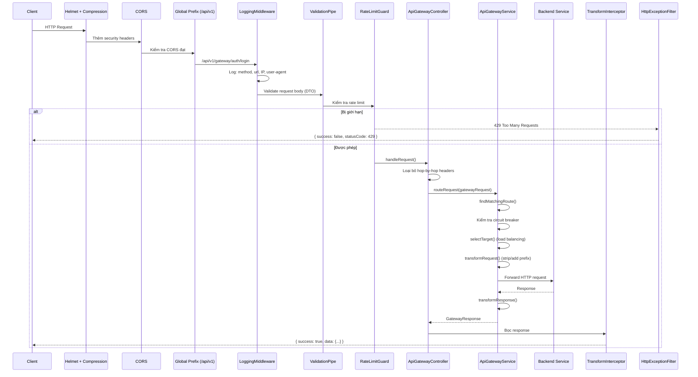
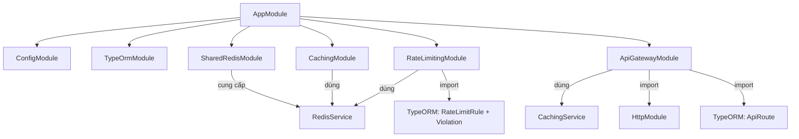
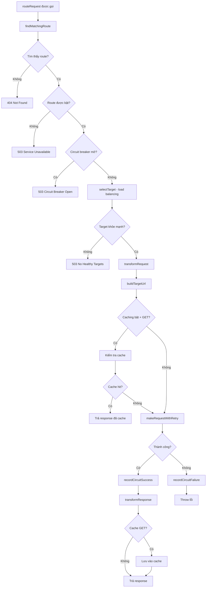
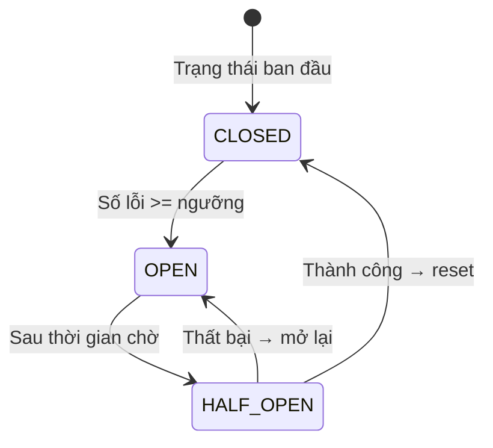
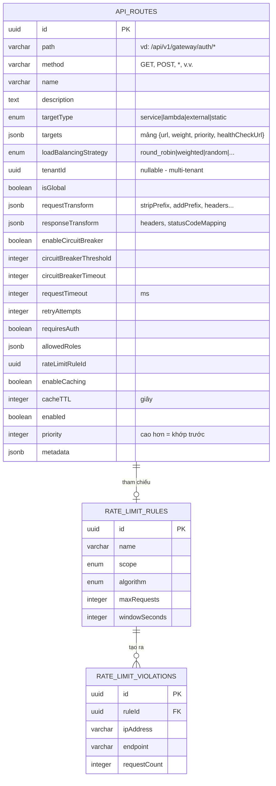

# Tài liệu Thiết kế: API Gateway Service

## 1. Tổng quan

API Gateway là điểm vào duy nhất cho tất cả request của client trong kiến trúc microservices. Thay vì client gọi trực tiếp từng service, client gọi gateway, gateway sẽ điều hướng request đến đúng backend service.

**Không có gateway:**
```
Client → Auth Service (:3003)
Client → User Service (:3001)
Client → Payment Service (:3004)
```

**Có gateway:**
```
Client → API Gateway (:3001) → Auth Service (:3003)
                              → User Service (:3002)
                              → Payment Service (:3004)
```

API Gateway trong project này là một NestJS 11 service với routing động, load balancing, circuit breaker, biến đổi request/response, caching, và rate limiting — tất cả cấu hình qua database (không hardcode).

**Vị trí source:** `apps/api-gateway/`

## 2. Kiến trúc

### 2.1 Cấu trúc thư mục

```
apps/api-gateway/src/
├── main.ts                                    # Khởi tạo app + bảo mật + Swagger
├── app.module.ts                              # Module gốc, kết nối tất cả
├── app.controller.ts                          # Endpoint health check
├── app.service.ts                             # Logic health check
│
├── config/
│   ├── database.config.ts                     # Cấu hình PostgreSQL từ env
│   └── redis.config.ts                        # Cấu hình Redis từ env
│
├── database/
│   ├── data-source.ts                         # Data source cho TypeORM CLI
│   └── seeds/run-seed.ts                      # Seeding database
│
├── modules/
│   └── api-gateway/
│       ├── api-gateway.module.ts              # Feature module (TypeORM + HttpModule)
│       ├── api-gateway.controller.ts          # CRUD route + catch-all proxy
│       ├── api-gateway.service.ts             # Logic routing chính
│       ├── entities/
│       │   └── api-route.entity.ts            # Entity định nghĩa route
│       └── dto/
│           ├── create-route.dto.ts            # Validation tạo route
│           ├── update-route.dto.ts            # Validation cập nhật route
│           ├── route-target.dto.ts            # Cấu hình target URL
│           └── index.ts                       # Barrel export
│
└── shared/
    ├── redis/
    │   └── shared-redis.module.ts             # Kết nối Redis toàn cục (singleton)
    ├── caching/
    │   ├── caching.module.ts                  # Module caching service
    │   ├── caching.service.ts                 # Redis cache với 6 chiến lược
    │   ├── decorators/cacheable.decorator.ts  # @Cacheable, @CacheInvalidate
    │   └── interceptors/cache.interceptor.ts  # Interceptor auto-cache
    ├── rate-limiting/
    │   ├── rate-limiting.module.ts            # Module rate limiting
    │   ├── rate-limiting.service.ts           # 4 thuật toán (Token Bucket, v.v.)
    │   ├── rate-limiting.controller.ts        # Admin API cho rules
    │   ├── guards/rate-limit.guard.ts         # Guard tự động rate limit
    │   ├── decorators/rate-limit.decorator.ts # @RateLimit, @SkipRateLimit
    │   ├── entities/rate-limit-rule.entity.ts
    │   ├── entities/rate-limit-violation.entity.ts
    │   └── dto/create-rate-limit-rule.dto.ts
    ├── filters/
    │   └── http-exception.filter.ts           # Format lỗi toàn cục
    ├── interceptors/
    │   └── transform.interceptor.ts           # Bọc response toàn cục
    ├── middleware/
    │   └── logging.middleware.ts              # Ghi log request
    └── pipes/
        └── validation.pipe.ts                 # Validation DTO
```

### 2.2 Vòng đời Request



### 2.3 Sơ đồ phụ thuộc Module



## 3. Lý thuyết: API Gateway làm gì?

### 3.1 Các trách nhiệm chính

| Trách nhiệm | Ý nghĩa | Ví dụ thực tế |
|-------------|---------|---------------|
| **Routing** | Điều hướng request đến đúng service | Kiểm soát không lưu sân bay điều phối máy bay đến đúng đường băng |
| **Load Balancing** | Phân tải giữa nhiều instance | Ngân hàng có nhiều quầy — khách đến quầy ít người nhất |
| **Circuit Breaker** | Ngắt gọi đến service đang lỗi | Cầu chì điện — ngắt điện trước khi hư hại lan rộng |
| **Rate Limiting** | Chống lạm dụng | Bảo vệ ở cửa quán bar — giới hạn sức chứa |
| **Caching** | Trả response đã cache | Lễ tân có sổ ghi chú — trả lời mà không cần gọi lên văn phòng |
| **Biến đổi Request** | Chỉnh sửa request trước khi forward | Phiên dịch viên tại hội nghị |
| **Biến đổi Response** | Chỉnh sửa response trước khi trả về | Biên tập viên xem lại trước khi xuất bản |
| **Auth & Bảo mật** | Xác thực trước khi điều hướng | Trạm kiểm tra an ninh ở lối vào tòa nhà |

### 3.2 Tại sao không gọi thẳng Service?

```
Không có Gateway:                   Có Gateway:
┌────────┐                          ┌────────┐
│ Client │──→ Auth:3003             │ Client │──→ Gateway:3001
│        │──→ Users:3002            │        │     ├──→ Auth:3003
│        │──→ Payment:3004          └────────┘     ├──→ Users:3002
│        │──→ Notification:3005                    ├──→ Payment:3004
└────────┘                                         └──→ Notification:3005

Vấn đề:                            Giải pháp:
- Client biết URL tất cả service   - Một URL duy nhất
- Không có rate limit tập trung    - Rate limit + auth tập trung
- Không có circuit breaking        - Circuit breaker theo route
- Khó thêm/xóa service            - Đổi route trong DB, không downtime
- Auth trùng lặp ở mỗi service    - Auth một lần tại gateway
```

### 3.3 Các mẫu thiết kế API Gateway

Có một số mẫu phổ biến về cách API gateway được sử dụng trong production:

#### Edge Gateway (Project này)

Gateway nằm ở rìa mạng. Tất cả traffic bên ngoài đi qua nó.

```
Internet → Edge Gateway → [Service A, Service B, Service C]
```

**Ưu điểm:** Một điểm kiểm soát duy nhất, bảo mật tập trung, đơn giản cho client.
**Nhược điểm:** Điểm lỗi duy nhất nếu không nhân bản, có thể là nút thắt cổ chai.

#### Backend-for-Frontend (BFF)

Một gateway cho mỗi loại client (web, mobile, IoT). Mỗi gateway tối ưu API cho client của nó.

```
Web App    → Web Gateway    → [Service A, B]
Mobile App → Mobile Gateway → [Service A, C]
IoT Device → IoT Gateway    → [Service D]
```

**Ưu điểm:** Mỗi client có API tối ưu riêng (vd: mobile nhận ít dữ liệu hơn, web nhận đầy đủ object).
**Nhược điểm:** Nhiều gateway cần bảo trì hơn, trùng lặp code giữa các gateway.

#### Mesh Gateway (Service Mesh Sidecar)

Mỗi service có proxy riêng (sidecar). Không có gateway tập trung — mỗi service tự xử lý routing, retry, circuit breaking.

```
Service A + Sidecar Proxy ←→ Service B + Sidecar Proxy
```

**Ưu điểm:** Không có điểm lỗi duy nhất, kiểm soát theo từng service.
**Nhược điểm:** Phức tạp khi thiết lập, tốn tài nguyên (một proxy cho mỗi service).

**Công cụ:** Istio, Linkerd, Envoy.

### 3.4 So sánh với API Gateway Production

| Tính năng | Project này | Kong | Nginx | AWS API Gateway | Spring Cloud Gateway |
|-----------|------------|------|-------|----------------|---------------------|
| **Ngôn ngữ** | TypeScript/NestJS | Lua/C (OpenResty) | C | Managed Service | Java/Spring |
| **Routing** | DB-driven, động | DB-driven, động | Config file, tĩnh | Console/API | Config/Code |
| **Load Balancing** | 5 chiến lược (in-app) | 4 chiến lược (nginx) | 5+ chiến lược (native) | Auto (AWS nội bộ) | Ribbon/Spring LB |
| **Circuit Breaker** | In-memory Map | Kong plugin | Không tích hợp | Không tích hợp | Resilience4j |
| **Rate Limiting** | Redis-backed, 4 thuật toán | Redis/local plugin | ngx_http_limit_req | Token bucket (AWS) | Redis-backed |
| **Caching** | Redis, 6 chiến lược | Redis/memory plugin | proxy_cache | Tích hợp CloudFront | Spring Cache |
| **Auth** | Dự kiến (JWT) | JWT/OAuth2 plugins | nginx-jwt module | Cognito/Lambda auth | Spring Security |
| **Cấu hình** | PostgreSQL | PostgreSQL/Cassandra | nginx.conf files | AWS Console/CloudFormation | YAML/Java code |
| **Hiệu năng** | ~5k req/s (Node) | ~30k req/s | ~50k+ req/s | Tự động scale | ~10k req/s |
| **Phù hợp cho** | Học tập, project nhỏ | Production, hệ sinh thái plugin | Hiệu năng cao, tĩnh | Serverless, hệ sinh thái AWS | Hệ sinh thái Spring |

**Điểm chính:**
- Kong và Nginx đã được kiểm chứng trong production với hàng chục nghìn request/giây.
- Project này triển khai cùng các pattern (routing, circuit breaker, rate limiting, caching) nhưng bằng TypeScript/NestJS — tuyệt vời để hiểu cách gateway hoạt động bên trong.
- AWS API Gateway là fully managed — không cần hạ tầng, nhưng bị ràng buộc với AWS.
- Spring Cloud Gateway là phiên bản Java tương đương, dùng cùng các pattern (route predicates, filters, circuit breaker).

### 3.5 Anti-Pattern cần tránh

#### God Gateway

**Vấn đề:** Gateway làm quá nhiều — business logic, biến đổi dữ liệu, tổng hợp, truy vấn database.

```
XẤU:  Client → Gateway (validate order, kiểm kho, tính giá, gọi thanh toán) → DB
TỐT:  Client → Gateway (route + auth) → Order Service (business logic) → DB
```

**Quy tắc:** Gateway nên điều hướng, không nên xử lý logic. Business logic thuộc về service.

#### Không có Circuit Breaking

**Vấn đề:** Một service lỗi khiến tất cả request dồn lại, làm các service khác bị thiếu tài nguyên.

```
XẤU:  Gateway → Auth (down, 30s timeout) × 1000 request = 30.000s bị chặn
TỐT:  Gateway → Auth (down, 5 lỗi) → circuit MỞ → 503 ngay lập tức
```

#### Điểm lỗi duy nhất

**Vấn đề:** Một instance gateway duy nhất = nếu nó crash, mọi thứ sập.

```
XẤU:  Client → Gateway (duy nhất) → Services
TỐT:  Client → Load Balancer → [Gateway 1, Gateway 2, Gateway 3] → Services
```

Trong production, luôn chạy nhiều instance gateway phía sau load balancer (AWS ALB, Nginx, HAProxy).

#### Liên kết chặt (Tight Coupling)

**Vấn đề:** Gateway biết quá nhiều về nội bộ service (cấu trúc endpoint cụ thể, format response).

```
XẤU:  Gateway hardcode: if (path === '/users/123') { callUserService.getUser(123) }
TỐT:  Gateway khớp wildcard: /api/v1/gateway/users/* → User Service
```

### 3.6 Best Practices

| Thực hành | Lý do | Project này |
|-----------|-------|-------------|
| Giữ gateway gọn nhẹ | Điều hướng, không xử lý logic. Business logic ở service | Có — gateway chỉ điều hướng |
| Thất bại nhanh | Circuit breaker + timeout ngăn lỗi lan truyền | Có — circuit breaker + retry |
| Health check | Biết target nào đang hoạt động | Một phần — endpoint tồn tại nhưng luôn trả `true` |
| Khả năng quan sát | Log mọi request, theo dõi metrics | Có — LoggingMiddleware + X-Gateway-Duration |
| Cấu hình động | Thay đổi routing không cần deploy | Có — route trong PostgreSQL |
| Retry idempotent | Chỉ retry thao tác an toàn (GET) hoặc có idempotency key | Không — retry tất cả method |
| Rate limit ở rìa | Chặn lạm dụng trước khi đến service | Có — RateLimitGuard toàn cục |
| Truyền Request ID | Theo dõi request xuyên suốt các service | Không — chưa triển khai |

## 4. Hệ thống Routing

### 4.1 Route matching hoạt động như thế nào

Khi request đến `@All('*path')`, gateway:

1. **Lấy tất cả route** từ DB (sắp xếp theo `priority` giảm dần)
2. **So khớp path** bằng regex (hỗ trợ wildcard `*`)
3. **So khớp method** (chính xác hoặc `*` cho tất cả)
4. **Route đầu tiên khớp thắng** (priority cao kiểm tra trước)

```typescript
// Route trong DB: { path: "/api/v1/gateway/auth/*", method: "*", priority: 10 }
// Request:        POST /api/v1/gateway/auth/login

// pattern: /api/v1/gateway/auth/* → regex: /^\/api\/v1\/gateway\/auth\/.*$/
// match: "/api/v1/gateway/auth/login".match(regex) → true
// method: "*" khớp "POST" → true
```

### 4.2 Pipeline biến đổi Request

```
Path gốc:        /api/v1/gateway/auth/login
                           │
stripPrefix="/api/v1/gateway"
                           │
                  /auth/login
                           │
addPrefix="/api/v1"
                           │
                  /api/v1/auth/login
                           │
buildTargetUrl("http://localhost:3003")
                           │
         http://localhost:3003/api/v1/auth/login
```

Headers cũng có thể được biến đổi:

```json
{
  "requestTransform": {
    "stripPrefix": "/api/v1/gateway",
    "addPrefix": "/api/v1",
    "addHeaders": { "X-Forwarded-By": "api-gateway" },
    "removeHeaders": ["X-Internal-Token"]
  },
  "responseTransform": {
    "addHeaders": { "X-Gateway": "true" },
    "removeHeaders": ["X-Internal-Debug"],
    "statusCodeMapping": { "502": 503 }
  }
}
```

### 4.3 Loại bỏ Hop-by-Hop Headers

Controller loại bỏ các headers này trước khi forward (để tránh lỗi "request aborted"):

```
content-length    → axios tính lại từ body đã serialize
host              → axios set thành host của target
transfer-encoding → không áp dụng cho request mới
connection        → quản lý giữa từng hop
keep-alive        → quản lý giữa từng hop
upgrade, expect, te → đặc thù protocol, không forward
```

Tất cả headers khác (Authorization, Content-Type, custom headers) được forward nguyên vẹn.

## 5. Deep Dive: Phân tích Source Code

### 5.1 Bootstrap (`main.ts`)

Hàm `bootstrap()` cấu hình toàn bộ ứng dụng trước khi khởi động HTTP server. Thứ tự quan trọng — mỗi tầng được xây dựng dựa trên tầng trước.

```typescript
async function bootstrap() {
  // 1. Tạo NestJS app với platform Express
  const app = await NestFactory.create<NestExpressApplication>(AppModule, {
    logger: ['error', 'warn', 'log', 'debug', 'verbose'],
  });
```

**Từng dòng:**
- `NestExpressApplication` — dùng Express bên dưới (không phải Fastify). Cho phép truy cập các tính năng Express như `req.ip`, `req.path`.
- `logger: [...]` — bật cả 5 mức log. Trong production thường tắt `debug` và `verbose`.

```typescript
  // 2. Global prefix — tất cả route bắt đầu bằng /api/v1
  app.setGlobalPrefix(apiPrefix);  // apiPrefix = "api/v1"
```

Nghĩa là `@Controller('gateway')` sẽ thành `/api/v1/gateway`. Mọi controller trong app đều tự động nhận prefix này.

```typescript
  // 3. Middleware bảo mật (chạy cho MỌI request, trước khi NestJS xử lý)
  app.use(helmet());       // Set 15+ security HTTP headers
  app.use(compression());  // Nén response body bằng Gzip (tiết kiệm bandwidth)
```

`helmet()` thêm các header như:
- `X-Content-Type-Options: nosniff` — ngăn MIME-type sniffing
- `X-Frame-Options: SAMEORIGIN` — ngăn clickjacking
- `Strict-Transport-Security` — bắt buộc HTTPS

`compression()` nén response > 1KB theo mặc định. Response JSON 50KB trở thành ~5KB qua đường truyền.

```typescript
  // 4. CORS — kiểm soát domain nào được gọi API này
  app.enableCors({
    origin: corsOrigins,           // ['*'] hoặc ['http://localhost:3000']
    credentials: true,             // Cho phép cookies/auth headers
    methods: ['GET', 'POST', 'PUT', 'PATCH', 'DELETE', 'OPTIONS'],
    allowedHeaders: ['Content-Type', 'Authorization'],
  });
```

**Tại sao `credentials: true`?** Nếu không có, browser sẽ không gửi cookies hoặc Authorization headers trong cross-origin request.

```typescript
  // 5. Global validation pipe
  app.useGlobalPipes(new ValidationPipe({
    whitelist: true,               // Loại bỏ property không có trong DTO
    forbidNonWhitelisted: true,    // Throw lỗi nếu gửi property không xác định
    transform: true,               // Tự động chuyển đổi kiểu (string "5" → number 5)
    transformOptions: {
      enableImplicitConversion: true,  // Bật chuyển đổi kiểu ngầm
    },
  }));
```

**`whitelist + forbidNonWhitelisted`** kết hợp nghĩa là: nếu DTO có `name` và `email`, mà client gửi `{ name, email, isAdmin: true }`, NestJS từ chối request với 400. Điều này ngăn tấn công mass-assignment.

```typescript
  // 6. Global exception filter và response interceptor
  app.useGlobalFilters(new HttpExceptionFilter());
  app.useGlobalInterceptors(new TransformInterceptor());
```

Hai cái này hoạt động cùng nhau:
- `HttpExceptionFilter` bắt lỗi và format thành `{ success: false, statusCode, error, message, path, timestamp }`
- `TransformInterceptor` bọc response thành công thành `{ success: true, statusCode, data, timestamp }`

**Thứ tự thực thi:**
```
Request → Interceptor (trước) → Controller → Interceptor (sau: bọc response)
                                            → Filter (chỉ khi có lỗi throw)
```

### 5.2 Controller: `handleRequest()` (`api-gateway.controller.ts:104-156`)

Đây là endpoint catch-all proxy. Mọi request không khớp route CRUD (`/routes`, `/routes/:id`) sẽ đến đây.

```typescript
@All('*path')
async handleRequest(
  @Req() req: Request,
  @Res({ passthrough: true }) res: Response,
) {
```

**`@All('*path')`** — khớp BẤT KỲ HTTP method nào (GET, POST, PUT, PATCH, DELETE) và BẤT KỲ path nào sau `/api/v1/gateway/`. `*path` là tham số wildcard của NestJS.

**`@Res({ passthrough: true })`** — cho phép chỉnh sửa response object (set headers, status code) đồng thời vẫn để NestJS xử lý giá trị trả về. Nếu không có `passthrough: true`, trả về giá trị từ method sẽ bị bỏ qua.

**Tại sao route CRUD được khai báo TRƯỚC `@All('*path')`:**

```typescript
// Các route này khai báo trước trong controller:
@Get('routes')          // khớp /api/v1/gateway/routes
@Get('routes/:id')      // khớp /api/v1/gateway/routes/abc123
@Post('routes')         // khớp /api/v1/gateway/routes
@Patch('routes/:id')    // khớp /api/v1/gateway/routes/abc123
@Delete('routes/:id')   // khớp /api/v1/gateway/routes/abc123

// Cái này khai báo CUỐI CÙNG:
@All('*path')           // khớp /api/v1/gateway/* (mọi thứ khác)
```

NestJS khớp route theo thứ tự khai báo. Nếu `@All('*path')` được đặt trước, nó sẽ chặn `GET /api/v1/gateway/routes` và cố proxy nó đến backend service thay vì trả về danh sách route.

**Loại bỏ hop-by-hop headers:**

```typescript
const HOP_BY_HOP_HEADERS = new Set([
  'content-length', 'transfer-encoding', 'connection',
  'keep-alive', 'host', 'upgrade', 'expect', 'te',
]);

const forwardHeaders: Record<string, string> = {};
for (const [key, value] of Object.entries(req.headers)) {
  if (!HOP_BY_HOP_HEADERS.has(key.toLowerCase()) && typeof value === 'string') {
    forwardHeaders[key] = value;
  }
}
```

**Tại sao cần thiết:**

Khi Express parse request đến, nó đọc body và set `content-length: 42` (kích thước byte thô). Nhưng khi axios gửi request đến backend, nó re-serialize `req.body` (một JS object đã parse) thành JSON. JSON sau khi re-serialize có thể có kích thước byte khác (vd: `43` byte do khác biệt khoảng trắng). Nếu chúng ta forward `content-length: 42` gốc, backend đọc 42 byte, rồi stream vẫn mở với 1 byte còn lại — gây ra `"request aborted"`.

**Kiểm tra `typeof value === 'string'`:** Headers trong Express có thể là `string | string[] | undefined`. Ví dụ, `set-cookie` có thể là mảng. Chúng ta chỉ forward header có giá trị string; mảng cần được join hoặc xử lý riêng.

**Xây dựng gatewayRequest:**

```typescript
const gatewayRequest = {
  path: req.path,       // vd: "/api/v1/gateway/auth/login"
  method: req.method,   // vd: "POST"
  headers: forwardHeaders,
  query: req.query as Record<string, string>,
  body: req.body,       // đã được Express JSON middleware parse
  tenantId: (req as any).user?.tenantId,  // từ JWT (khi auth được triển khai)
  userId: (req as any).user?.id,
};
```

**Set response headers:**

```typescript
const response = await this.gatewayService.routeRequest(gatewayRequest);

// Forward response headers từ backend đến client
Object.entries(response.headers).forEach(([key, value]) => {
  res.setHeader(key, value);
});

// Thêm headers riêng của gateway (debugging/monitoring)
res.setHeader('X-Gateway-Target', response.targetUrl);   // backend nào được gọi
res.setHeader('X-Gateway-Duration', response.duration.toString()); // mất bao lâu

res.status(response.status);  // forward status code của backend (200, 201, 404, v.v.)
return response.body;  // NestJS serialize thành JSON
```

### 5.3 Service: `routeRequest()` (`api-gateway.service.ts:68-183`)

Đây là method điều phối chính. Nó phối hợp tất cả tính năng gateway theo trình tự.



**Từng bước:**

```typescript
async routeRequest(request: GatewayRequest): Promise<GatewayResponse> {
  const startTime = Date.now();  // bắt đầu đo thời gian
```

**Bước 1: Tìm route khớp**
```typescript
  const route = await this.findMatchingRoute(request);
  if (!route) {
    throw new HttpException('No route found for this request', HttpStatus.NOT_FOUND);
  }
  if (!route.enabled) {
    throw new HttpException('This route is disabled', HttpStatus.SERVICE_UNAVAILABLE);
  }
```

Route có thể bị tắt qua `PATCH /routes/:id { "enabled": false }` để bảo trì mà không cần xóa.

**Bước 2: Kiểm tra circuit breaker**
```typescript
  if (route.enableCircuitBreaker && this.isCircuitOpen(route.id)) {
    throw new HttpException(
      'Service temporarily unavailable (circuit breaker open)',
      HttpStatus.SERVICE_UNAVAILABLE,
    );
  }
```

Nếu circuit đang MỞ, chúng ta không thử gọi backend — trả 503 ngay lập tức. Điều này bảo vệ hệ thống khỏi cascading timeout.

**Bước 3: Load balancing — chọn target**
```typescript
  const target = this.selectTarget(route);
  if (!target) {
    throw new HttpException('No healthy targets available', HttpStatus.SERVICE_UNAVAILABLE);
  }
```

**Bước 4: Biến đổi + xây dựng URL + kiểm tra cache tùy chọn**
```typescript
  const transformedRequest = this.transformRequest(request, route);
  const targetUrl = this.buildTargetUrl(target.url, transformedRequest);

  if (route.enableCaching && request.method === 'GET') {
    const cached = await this.getCachedResponse(targetUrl);
    if (cached) return { ...cached, targetUrl, duration: Date.now() - startTime };
  }
```

Chỉ request GET được cache vì GET là idempotent (cùng request = cùng response). POST/PATCH/DELETE có side effect.

**Bước 5: Thực hiện HTTP call thật**
```typescript
  const response = await this.makeRequestWithRetry(
    targetUrl, transformedRequest, route.retryAttempts, route.requestTimeout,
  );
```

**Bước 6: Ghi nhận thành công + biến đổi response + cache**
```typescript
  this.recordCircuitSuccess(route.id);  // reset bộ đếm lỗi
  const transformedResponse = this.transformResponse(response, route);

  if (route.enableCaching && request.method === 'GET') {
    await this.cacheResponse(targetUrl, transformedResponse, route.cacheTTL);
  }
```

**Bước 7: Xử lý lỗi**
```typescript
  } catch (error) {
    this.recordCircuitFailure(route.id, route);  // tăng bộ đếm lỗi

    if (error instanceof HttpException) throw error;  // re-throw lỗi của chúng ta

    if (error instanceof AxiosError) {
      // Backend trả về lỗi (vd: 400 Bad Request từ auth service)
      throw new HttpException(
        error.response?.data || error.message,
        error.response?.status || HttpStatus.BAD_GATEWAY,  // 502 nếu không có response
      );
    }

    throw new HttpException(message, HttpStatus.BAD_GATEWAY);
  }
```

**Quan trọng:** `AxiosError` có thể có `error.response` (backend phản hồi với error status) hoặc không (lỗi mạng, timeout). Khi `error.response` là `undefined`, nghĩa là backend không bao giờ phản hồi, nên chúng ta trả 502 Bad Gateway.

### 5.4 Service: `findMatchingRoute()` + `matchesRoute()` (`api-gateway.service.ts:293-322`)

```typescript
private async findMatchingRoute(request: GatewayRequest): Promise<ApiRoute | null> {
  const routes = await this.getRoutes(request.tenantId);
  // routes đã được sắp xếp theo priority giảm dần (từ getRoutes)

  for (const route of routes) {
    if (this.matchesRoute(request, route)) {
      return route;  // route đầu tiên khớp thắng
    }
  }
  return null;
}
```

**`getRoutes(tenantId)`** trả về route theo thứ tự `priority DESC`. Điều này quan trọng vì route có priority 20 được kiểm tra trước priority 10. Khi nhiều route có thể khớp cùng path, route có priority cao hơn sẽ thắng.

**Ví dụ xung đột priority:**
```
Route A: path="/api/v1/gateway/auth/*",    priority=10  → tất cả auth
Route B: path="/api/v1/gateway/auth/admin/*", priority=20 → chỉ admin auth
```

Request `POST /api/v1/gateway/auth/admin/users` khớp cả A và B. Vì B có priority cao hơn (20 > 10), B được kiểm tra trước và thắng. Nếu không có priority, A sẽ khớp trước và điều hướng admin request đến service sai.

```typescript
private matchesRoute(request: GatewayRequest, route: ApiRoute): boolean {
  // 1. Khớp method
  if (route.method !== '*' && route.method !== request.method) {
    return false;
  }

  // 2. Khớp path — chuyển wildcard thành regex
  const routePath = route.path.replace(/\*/g, '.*');  // "/auth/*" → "/auth/.*"
  const regex = new RegExp(`^${routePath}$`);          // neo đầu và cuối

  return regex.test(request.path);
}
```

**Chuyển đổi regex:**
- `*` trong path route trở thành `.*` trong regex (khớp bất kỳ ký tự nào)
- `^...$` neo đảm bảo khớp toàn bộ path (không phải khớp một phần)
- Ví dụ: `/api/v1/gateway/auth/*` trở thành `/^\/api\/v1\/gateway\/auth\/.*$/`

**Edge case:** Path route `/api/v1/gateway/auth` (không có wildcard) chỉ khớp chính xác `/api/v1/gateway/auth`, không khớp `/api/v1/gateway/auth/login`. Bạn cần `/*` ở cuối để khớp sub-path.

### 5.5 Service: `selectTarget()` — Điều phối Load Balancing (`api-gateway.service.ts:327-357`)

```typescript
private selectTarget(route: ApiRoute): { url: string; weight?: number } | null {
  // 1. Lọc chỉ target khỏe mạnh
  const healthyTargets = route.targets.filter((target) =>
    this.isTargetHealthy(target.url),
  );

  if (healthyTargets.length === 0) return null;

  // 2. Điều phối đến chiến lược
  switch (route.loadBalancingStrategy) {
    case LoadBalancingStrategy.ROUND_ROBIN:
      return this.roundRobinSelect(route.id, healthyTargets);
    case LoadBalancingStrategy.WEIGHTED:
      return this.weightedSelect(healthyTargets);
    case LoadBalancingStrategy.RANDOM:
      return healthyTargets[Math.floor(Math.random() * healthyTargets.length)];
    case LoadBalancingStrategy.LEAST_CONNECTIONS:
      return this.roundRobinSelect(route.id, healthyTargets); // fallback
    default:
      return healthyTargets[0];
  }
}
```

**Lưu ý:** `isTargetHealthy()` hiện tại luôn trả về `true`. Trong production, bạn sẽ ping health endpoint của mỗi target định kỳ và cache kết quả trong Redis.

### 5.6 Service: `roundRobinSelect()` (`api-gateway.service.ts:362-372`)

```typescript
private roundRobinSelect(
  routeId: string,
  targets: Array<{ url: string }>,
): { url: string } {
  const counter = this.targetCounters.get(routeId) || 0;  // lấy vị trí hiện tại
  const index = counter % targets.length;                   // quay vòng

  this.targetCounters.set(routeId, counter + 1);           // tăng bộ đếm

  return targets[index];
}
```

**Modulo tạo ra sự xoay vòng như thế nào:**
```
targets = [A, B, C]  (length = 3)

counter=0: 0 % 3 = 0 → A
counter=1: 1 % 3 = 1 → B
counter=2: 2 % 3 = 2 → C
counter=3: 3 % 3 = 0 → A  (quay lại đầu)
counter=4: 4 % 3 = 1 → B
```

**Hạn chế:** Bộ đếm nằm trong bộ nhớ (`Map`). Nếu bạn chạy 3 instance gateway, mỗi cái có bộ đếm riêng — chúng không phối hợp với nhau. Bộ đếm reset khi restart.

### 5.7 Service: `weightedSelect()` (`api-gateway.service.ts:377-392`)

```typescript
private weightedSelect(targets: Array<{ url: string; weight?: number }>) {
  // 1. Tổng tất cả weight (mặc định weight = 1 nếu không chỉ định)
  const totalWeight = targets.reduce((sum, t) => sum + (t.weight || 1), 0);

  // 2. Tạo số ngẫu nhiên từ 0 đến totalWeight
  let random = Math.random() * totalWeight;

  // 3. Duyệt qua các target, trừ weight từng cái
  for (const target of targets) {
    random -= target.weight || 1;
    if (random <= 0) {
      return target;  // target này "hấp thụ" số ngẫu nhiên
    }
  }

  return targets[0];  // fallback (không nên đến đây)
}
```

**Ví dụ trực quan:**
```
targets: [A(weight:3), B(weight:2), C(weight:1)]
totalWeight = 6

Trục số: [--- A (0-3) ---][-- B (3-5) --][- C (5-6) -]

random = 2.5: 2.5-3 = -0.5 <= 0 → A
random = 4.0: 4.0-3 = 1.0 > 0, 1.0-2 = -1.0 <= 0 → B
random = 5.5: 5.5-3 = 2.5 > 0, 2.5-2 = 0.5 > 0, 0.5-1 = -0.5 <= 0 → C
```

Qua nhiều request, A nhận ~50% (3/6), B nhận ~33% (2/6), C nhận ~17% (1/6).

### 5.8 Service: `transformRequest()` (`api-gateway.service.ts:406-453`)

```typescript
private transformRequest(request: GatewayRequest, route: ApiRoute): GatewayRequest {
  const transformed = { ...request };  // shallow copy (không mutate bản gốc)

  if (route.requestTransform) {
    // Thêm custom headers (merge với headers hiện tại)
    if (route.requestTransform.addHeaders) {
      transformed.headers = { ...transformed.headers, ...route.requestTransform.addHeaders };
    }

    // Xóa headers cụ thể
    if (route.requestTransform.removeHeaders) {
      route.requestTransform.removeHeaders.forEach((header) => {
        delete transformed.headers[header];
      });
    }

    // Thêm query parameters
    if (route.requestTransform.addQueryParams) {
      transformed.query = { ...transformed.query, ...route.requestTransform.addQueryParams };
    }

    // Bước 1: Loại bỏ prefix
    if (route.requestTransform.stripPrefix) {
      const prefix = route.requestTransform.stripPrefix;
      if (transformed.path.startsWith(prefix)) {
        transformed.path = transformed.path.slice(prefix.length) || '/';
      }
    }

    // Bước 2: Thêm prefix
    if (route.requestTransform.addPrefix) {
      transformed.path = route.requestTransform.addPrefix + transformed.path;
    }

    // Bước 3: Viết lại path (ghi đè mọi thứ ở trên)
    if (route.requestTransform.rewritePath) {
      transformed.path = route.requestTransform.rewritePath;
    }
  }

  return transformed;
}
```

**Thứ tự thực thi quan trọng:**

```
Path đầu vào: /api/v1/gateway/auth/login

Bước 1 (stripPrefix="/api/v1/gateway"):
  "/api/v1/gateway/auth/login".startsWith("/api/v1/gateway") → true
  "/api/v1/gateway/auth/login".slice(17) → "/auth/login"

Bước 2 (addPrefix="/api/v1"):
  "/api/v1" + "/auth/login" → "/api/v1/auth/login"

Bước 3 (rewritePath) — KHÔNG được set, nên bỏ qua.

Path cuối cùng: /api/v1/auth/login
```

**Fallback `|| '/'`:** Nếu `stripPrefix` xóa toàn bộ path (vd: path là `/api/v1/gateway` và stripPrefix là `/api/v1/gateway`), `slice()` trả về chuỗi rỗng `""`. `|| '/'` đảm bảo chúng ta nhận được `/` thay vì chuỗi rỗng.

### 5.9 Service: `buildTargetUrl()` (`api-gateway.service.ts:500-512`)

```typescript
private buildTargetUrl(baseUrl: string, request: GatewayRequest): string {
  const url = new URL(baseUrl);    // parse "http://localhost:3003" thành URL object

  url.pathname = request.path;     // THAY THẾ pathname hoàn toàn

  // Thêm query parameters
  Object.entries(request.query || {}).forEach(([key, value]) => {
    url.searchParams.append(key, value);
  });

  return url.toString();
  // "http://localhost:3003/api/v1/auth/login?page=1&limit=10"
}
```

**Quan trọng: `url.pathname = request.path` thay thế, không nối thêm.** Đây là lý do target URL trong route nên là `http://localhost:3003` (không có path), không phải `http://localhost:3003/api/v1`. Nếu target URL đã có path như `/api/v1`, nó sẽ bị ghi đè hoàn toàn bởi `request.path`.

### 5.10 Service: `makeRequestWithRetry()` (`api-gateway.service.ts:517-550`)

```typescript
private async makeRequestWithRetry(
  url: string,
  request: GatewayRequest,
  maxRetries: number,     // từ route.retryAttempts (mặc định: 3)
  timeout: number,        // từ route.requestTimeout (mặc định: 30000ms)
): Promise<any> {
  let lastError: AxiosError | Error;

  for (let attempt = 0; attempt <= maxRetries; attempt++) {
    try {
      const response = await firstValueFrom(
        this.httpService.request({
          url,
          method: request.method,
          headers: request.headers,
          data: request.body,
          timeout,
        }),
      );
      return response;  // thành công — trả về ngay
    } catch (error) {
      lastError = error instanceof Error ? error : new Error('Unknown error');

      if (attempt < maxRetries) {
        // Exponential backoff: 1s, 2s, 4s, 8s, tối đa 10s
        const delay = Math.min(1000 * Math.pow(2, attempt), 10000);
        await new Promise((resolve) => setTimeout(resolve, delay));
      }
    }
  }

  throw lastError;  // hết retry
}
```

**Tại sao `firstValueFrom()`?** NestJS `HttpService` trả về RxJS `Observable`, không phải Promise. `firstValueFrom()` chuyển Observable thành Promise bằng cách lấy giá trị đầu tiên được emit.

**Công thức exponential backoff: `min(1000 * 2^attempt, 10000)`**

```
attempt=0: min(1000 * 1, 10000) = 1000ms  (1 giây)
attempt=1: min(1000 * 2, 10000) = 2000ms  (2 giây)
attempt=2: min(1000 * 4, 10000) = 4000ms  (4 giây)
attempt=3: min(1000 * 8, 10000) = 8000ms  (8 giây)
attempt=4: min(1000 * 16, 10000) = 10000ms (10 giây, đạt giới hạn)
```

**Tổng thời gian chờ cho 3 lần retry:** 1s + 2s + 4s = 7s chờ + thời gian request thực tế.

**Quan trọng: retry xảy ra cho TẤT CẢ lỗi**, kể cả response 4xx. Trong production, bạn chỉ nên retry cho 5xx (lỗi server) và lỗi mạng, không cho 400 Bad Request hoặc 401 Unauthorized.

### 5.11 Các method Circuit Breaker (`api-gateway.service.ts:559-601`)

Circuit breaker dùng 3 Map trong bộ nhớ:

```typescript
private circuitStates: Map<string, CircuitState> = new Map();   // routeId → CLOSED/OPEN/HALF_OPEN
private circuitFailures: Map<string, number> = new Map();       // routeId → số lỗi
private targetCounters: Map<string, number> = new Map();        // routeId → bộ đếm round-robin
```

**`isCircuitOpen()`:**

```typescript
private isCircuitOpen(routeId: string): boolean {
  return this.circuitStates.get(routeId) === CircuitState.OPEN;
}
```

Trạng thái mặc định (không có trong Map) được coi là CLOSED (circuit hoạt động bình thường).

**`recordCircuitSuccess()`:**

```typescript
private recordCircuitSuccess(routeId: string): void {
  this.circuitFailures.set(routeId, 0);  // reset bộ đếm lỗi về 0

  // Nếu đang ở HALF_OPEN (đang thử), chuyển về CLOSED
  if (this.circuitStates.get(routeId) === CircuitState.HALF_OPEN) {
    this.circuitStates.set(routeId, CircuitState.CLOSED);
    this.logger.log(`Circuit breaker CLOSED for route ${routeId}`);
  }
}
```

**`recordCircuitFailure()`:**

```typescript
private recordCircuitFailure(routeId: string, route: ApiRoute): void {
  if (!route.enableCircuitBreaker) return;  // circuit breaker bị tắt cho route này

  const failures = (this.circuitFailures.get(routeId) || 0) + 1;
  this.circuitFailures.set(routeId, failures);

  if (failures >= route.circuitBreakerThreshold) {  // đạt ngưỡng (mặc định: 5)
    this.circuitStates.set(routeId, CircuitState.OPEN);
    this.logger.warn(`Circuit breaker OPENED for route ${routeId}`);

    // Lập lịch tự động chuyển sang HALF_OPEN sau timeout
    setTimeout(() => {
      this.circuitStates.set(routeId, CircuitState.HALF_OPEN);
      this.logger.log(`Circuit breaker HALF-OPEN for route ${routeId}`);
    }, route.circuitBreakerTimeout * 1000);  // mặc định: 60 giây
  }
}
```

**`setTimeout` cho HALF_OPEN:** Sau khi circuit mở, một timer bắt đầu. Khi nó kích hoạt (mặc định 60 giây sau), circuit chuyển sang HALF_OPEN, cho phép một request thử đi qua. Nếu request đó thành công (`recordCircuitSuccess` được gọi), circuit đóng hoàn toàn. Nếu thất bại, circuit mở lại với timer 60 giây mới.

**Sơ đồ chuyển trạng thái với số lỗi:**

```
CLOSED (failures=0)
  |
  | lỗi → failures=1
  | lỗi → failures=2
  | ...
  | lỗi → failures=5 (>= ngưỡng)
  |
OPEN (tất cả request → 503 ngay lập tức)
  |
  | (60 giây trôi qua qua setTimeout)
  |
HALF_OPEN (cho phép 1 request đi qua)
  |
  +-- thành công → CLOSED (failures=0)
  |
  +-- thất bại → OPEN (bắt đầu timer 60 giây mới)
```

### 5.12 Các method Cache (`api-gateway.service.ts:652-686`)

```typescript
private async getCachedResponse(url: string): Promise<GatewayResponse | null> {
  try {
    const cached = await this.cachingService.get(`gateway:cache:${url}`);
    return cached;
  } catch (error) {
    this.logger.error('Cache get error:', error instanceof Error ? error.message : error);
    return null;  // khi cache lỗi, tiếp tục không dùng cache (fail-open)
  }
}
```

**Format cache key:** `gateway:cache:http://localhost:3003/api/v1/auth/users?page=1`

Toàn bộ URL (bao gồm query params) được dùng làm cache key. Nghĩa là `?page=1` và `?page=2` được cache riêng biệt.

**Pattern fail-open:** Nếu Redis down, các method cache bắt lỗi và trả về `null` thay vì crash. Request tiếp tục mà không có cache. Đây là pattern resilience phổ biến — cache là tối ưu hiệu năng, không phải yêu cầu bắt buộc.

```typescript
private async cacheResponse(url: string, response: any, ttl: number = 60): Promise<void> {
  try {
    await this.cachingService.set(`gateway:cache:${url}`, response, { ttl });
  } catch (error) {
    this.logger.error('Cache set error:', error instanceof Error ? error.message : error);
    // Không throw — lỗi cache không nên làm hỏng request
  }
}
```

### 5.13 `TransformInterceptor` (`shared/interceptors/transform.interceptor.ts`)

```typescript
@Injectable()
export class TransformInterceptor<T> implements NestInterceptor<T, Response<T>> {
  intercept(context: ExecutionContext, next: CallHandler): Observable<Response<T>> {
    const response = context.switchToHttp().getResponse();
    const statusCode = response.statusCode || HttpStatus.OK;

    return next.handle().pipe(
      map((data) => ({
        success: statusCode < 400,
        statusCode,
        data,
        timestamp: new Date().toISOString(),
      })),
    );
  }
}
```

**Cách hoạt động:**
1. `next.handle()` gọi method controller và trả kết quả dưới dạng Observable.
2. `map()` biến đổi kết quả bằng cách bọc nó trong format response chuẩn.
3. Controller trả về `{ id: "123", name: "John" }`, interceptor biến đổi thành `{ success: true, statusCode: 200, data: { id: "123", name: "John" }, timestamp: "..." }`.

**Kiểm tra `statusCode < 400`:** Nếu controller chủ động set status 4xx (vd: `res.status(400)`), response sẽ hiển thị `success: false`. Trong thực tế, lỗi đi qua `HttpExceptionFilter` thay vì đây.

### 5.14 `HttpExceptionFilter` (`shared/filters/http-exception.filter.ts`)

```typescript
@Catch()  // bắt TẤT CẢ exception, không chỉ HttpException
export class HttpExceptionFilter implements ExceptionFilter {
  catch(exception: unknown, host: ArgumentsHost) {
    const ctx = host.switchToHttp();
    const response = ctx.getResponse<Response>();
    const request = ctx.getRequest<Request>();

    let status = HttpStatus.INTERNAL_SERVER_ERROR;  // mặc định: 500
    let message = 'Internal server error';
    let error = 'InternalServerError';

    if (exception instanceof HttpException) {
      // NestJS HTTP exceptions (throw new NotFoundException(), v.v.)
      status = exception.getStatus();
      const exceptionResponse = exception.getResponse();
      // ... trích xuất message và error name
    } else if (exception instanceof Error) {
      // Lỗi JS thường (không được bắt)
      message = exception.message;
      error = exception.name;
    }

    // Log với stack trace để debug
    this.logger.error(
      `${request.method} ${request.url} - ${status} - ${error}: ${JSON.stringify(message)}`,
      exception instanceof Error ? exception.stack : undefined,
    );

    // Gửi response lỗi chuẩn hóa
    response.status(status).json({
      success: false,
      statusCode: status,
      error,
      message,
      path: request.url,
      timestamp: new Date().toISOString(),
    });
  }
}
```

**`@Catch()` không có tham số** bắt mọi thứ — không chỉ `HttpException`, mà còn `TypeError`, `ReferenceError`, lỗi kết nối database, v.v. Nếu không có này, NestJS sẽ trả về trang HTML lỗi chung cho các exception không phải HTTP.

### 5.15 `LoggingMiddleware` (`shared/middleware/logging.middleware.ts`)

```typescript
@Injectable()
export class LoggingMiddleware implements NestMiddleware {
  private readonly logger = new Logger('HTTP');

  use(req: Request, res: Response, next: NextFunction) {
    const { method, originalUrl, ip } = req;
    const userAgent = req.get('user-agent') || '';
    const startTime = Date.now();

    // Lắng nghe sự kiện response hoàn thành
    res.on('finish', () => {
      const { statusCode } = res;
      const contentLength = res.get('content-length');
      const responseTime = Date.now() - startTime;

      this.logger.log(
        `${method} ${originalUrl} ${statusCode} ${contentLength || 0}b - ${responseTime}ms - ${ip} ${userAgent}`,
      );
    });

    next();  // chuyển sang middleware/handler tiếp theo
  }
}
```

**Tại sao `res.on('finish')`?** Middleware chạy TRƯỚC controller. Chúng ta muốn log status code và thời gian response, chỉ có sẵn SAU KHI controller hoàn thành. Bằng cách gắn listener vào sự kiện `finish` của response, chúng ta bắt được status code cuối cùng và tính tổng thời gian.

**`originalUrl` vs `url`:** `originalUrl` giữ nguyên path đầy đủ bao gồm global prefix (`/api/v1/gateway/auth/login`). `url` có thể bị chỉnh sửa bởi middleware hoặc rewriting.

## 6. Load Balancing

### 6.1 5 chiến lược

#### Round Robin (Mặc định)

Xoay vòng qua các target theo thứ tự.

```
Request 1 → Target A
Request 2 → Target B
Request 3 → Target C
Request 4 → Target A (quay lại đầu)
```

Dùng bộ đếm trong bộ nhớ cho mỗi route. Đơn giản và công bằng.

**Khi nào dùng:** Lựa chọn mặc định. Hoạt động tốt khi tất cả target có cấu hình tương tự.

**Khi nào KHÔNG dùng:** Khi server có spec khác nhau (một cái 8GB RAM, cái khác 32GB). Dùng Weighted thay thế.

#### Weighted (Theo trọng số)

Weight cao hơn = nhiều traffic hơn. Hữu ích khi server có cấu hình khác nhau.

```
targets: [
  { url: "http://server-a", weight: 3 },  ← nhận ~50% traffic
  { url: "http://server-b", weight: 2 },  ← nhận ~33% traffic
  { url: "http://server-c", weight: 1 },  ← nhận ~17% traffic
]
```

Thuật toán: số ngẫu nhiên × tổng weight, trừ weight từng target cho đến khi ≤ 0.

**Khi nào dùng:** Server có kích cỡ khác nhau, canary deployment (phiên bản mới weight=1, phiên bản cũ weight=9 → 10% canary traffic).

#### Random (Ngẫu nhiên)

Chọn ngẫu nhiên hoàn toàn. Theo thống kê sẽ đều theo thời gian.

**Khi nào dùng:** Khi bạn muốn đơn giản và không cần hành vi xác định.

**Khi nào KHÔNG dùng:** Số lượng request ít — random có thể rất không đều (vd: 5 request có thể đều đến cùng target).

#### Least Connections (Ít kết nối nhất)

Hiện tại triển khai như round robin (đơn giản hóa). Trong production sẽ theo dõi số kết nối active mỗi target.

**Cách hoạt động trong production:**
```
Target A: 5 kết nối active
Target B: 2 kết nối active
Target C: 8 kết nối active
→ request tiếp theo đến Target B (ít bận nhất)
```

#### IP Hash

Chưa triển khai trong code (chỉ có enum). Sẽ hash IP của client để luôn điều hướng đến cùng target (session affinity).

**Cách hoạt động:**
```
hash("192.168.1.1") % 3 = 0 → Target A (luôn luôn)
hash("192.168.1.2") % 3 = 2 → Target C (luôn luôn)
```

**Khi nào dùng:** Khi backend lưu session state trong bộ nhớ (không phải Redis/DB). Cùng client luôn đến cùng server.

### 6.2 So sánh

| Chiến lược | Công bằng | Dự đoán được | Session Affinity | Độ phức tạp |
|-----------|----------|-------------|-----------------|------------|
| Round Robin | Cao | Cao | Không | Thấp |
| Weighted | Tùy chỉnh | Trung bình | Không | Thấp |
| Random | Thống kê | Thấp | Không | Thấp |
| Least Connections | Cao | Thấp | Không | Trung bình |
| IP Hash | Khác nhau | Cao | Có | Thấp |

## 7. Circuit Breaker

### 7.1 Lý thuyết

Circuit breaker ngăn chặn lỗi lan truyền. Nếu một service đang down, ngừng gọi nó thay vì đợi timeout.

Ba trạng thái:



**CLOSED** — Hoạt động bình thường. Request đi qua. Đếm số lỗi.
**OPEN** — Service đang down. Tất cả request lập tức trả 503. Không gọi thật.
**HALF_OPEN** — Sau timeout, cho phép một request thử. Nếu thành công → CLOSED. Nếu thất bại → OPEN lại.

### 7.2 Cách hoạt động trong code

```
Cấu hình route: enableCircuitBreaker: true, circuitBreakerThreshold: 5, circuitBreakerTimeout: 60

Request 1: lỗi  → failures: 1
Request 2: lỗi  → failures: 2
Request 3: lỗi  → failures: 3
Request 4: lỗi  → failures: 4
Request 5: lỗi  → failures: 5 → CIRCUIT MỞ

Request 6: → 503 "Service tạm thời không khả dụng (circuit breaker open)"
Request 7: → 503 (không gọi HTTP thật)
...
(60 giây trôi qua)

Circuit → HALF_OPEN
Request N: → thử gọi thật
  Nếu thành công → CIRCUIT ĐÓNG, failures reset về 0
  Nếu thất bại   → CIRCUIT MỞ, đợi thêm 60 giây
```

### 7.3 Ví dụ thực tế

```
Gateway → Auth Service (đang down)

Không có circuit breaker:
  1000 request → 1000 timeout (30 giây mỗi cái) → 30.000 giây chờ → các service khác bị ảnh hưởng

Có circuit breaker (ngưỡng: 5):
  5 request → 5 timeout → circuit MỞ
  995 request → 503 ngay lập tức → không chờ → các service khác không bị ảnh hưởng
```

### 7.4 Circuit Breaker trong Production (So sánh)

| Tính năng | Project này | Resilience4j (Java) | Polly (.NET) | Hystrix (deprecated) |
|-----------|------------|---------------------|-------------|---------------------|
| Lưu trạng thái | In-memory Map | In-memory | In-memory | In-memory |
| Cửa sổ trượt | Không | Có (count/time-based) | Có | Có (time-based) |
| Tỷ lệ lỗi % | Không (chỉ đếm) | Có (cấu hình %) | Có | Có |
| Giới hạn half-open | 1 request | Cấu hình N request | Cấu hình | 1 request |
| Metrics/events | Chỉ Logger | Event publisher | Event publisher | Metrics stream |

**Cửa sổ trượt** nghĩa là: "50% trong 100 request gần nhất thất bại" vs "5 lỗi liên tiếp" của project này. Cửa sổ trượt chính xác hơn vì 5 lỗi trong 10.000 request thành công không nên mở circuit.

## 8. Retry với Exponential Backoff

Khi request thất bại, gateway thử lại với khoảng cách tăng dần:

```
Lần thử 0: request → lỗi
  đợi: min(1000 × 2^0, 10000) = 1000ms (1 giây)
Lần thử 1: request → lỗi
  đợi: min(1000 × 2^1, 10000) = 2000ms (2 giây)
Lần thử 2: request → lỗi
  đợi: min(1000 × 2^2, 10000) = 4000ms (4 giây)
Lần thử 3: request → lỗi → bỏ cuộc (retryAttempts: 3)
```

Giới hạn tối đa 10 giây để tránh đợi quá lâu.

**Tại sao exponential?** Nếu service đang bị quá tải tạm thời, retry liên tục sẽ làm tình trạng tệ hơn. Tăng khoảng cách cho service thời gian phục hồi.

**Tại sao giới hạn 10 giây?** Nếu không giới hạn, lần thử 10 sẽ đợi `1000 * 2^10 = 1.024.000ms` (17 phút). Giới hạn ngăn thời gian chờ bất hợp lý.

**Cải thiện cho production — thêm jitter:**
```typescript
// Hiện tại: delay cố định
const delay = Math.min(1000 * Math.pow(2, attempt), 10000);

// Tốt hơn: thêm jitter ngẫu nhiên để phân tán retry theo thời gian
const delay = Math.min(1000 * Math.pow(2, attempt), 10000) * (0.5 + Math.random());
```

Nếu không có jitter, khi 100 request lỗi cùng lúc, tất cả đều retry sau đúng 1 giây, rồi 2 giây, rồi 4 giây — tạo ra các đợt "thundering herd" (bầy đàn ồ ạt). Jitter phân tán chúng ngẫu nhiên trong cửa sổ thời gian.

## 9. Hạ tầng toàn cục

### 9.1 Format Response

Tất cả response được bọc bởi `TransformInterceptor`:

```json
// Thành công
{
  "success": true,
  "statusCode": 200,
  "data": { "id": "123", "name": "John" },
  "timestamp": "2026-02-18T10:00:00.000Z"
}

// Lỗi (từ HttpExceptionFilter)
{
  "success": false,
  "statusCode": 404,
  "error": "NotFoundException",
  "message": "Route not found",
  "path": "/api/v1/gateway/unknown",
  "timestamp": "2026-02-18T10:00:00.000Z"
}
```

### 9.2 Tầng bảo mật

| Tầng | Chức năng | Vị trí |
|------|----------|--------|
| Helmet | Set security HTTP headers (X-Frame-Options, CSP, v.v.) | main.ts |
| Compression | Nén response body bằng Gzip | main.ts |
| CORS | Kiểm soát truy cập cross-origin | main.ts |
| ValidationPipe | Từ chối request body không hợp lệ | main.ts (toàn cục) |
| Rate Limiting | Chống lạm dụng | RateLimitGuard |
| Auth (dự kiến) | Xác thực JWT | Cờ `requiresAuth` trên mỗi route |

### 9.3 Logging

`LoggingMiddleware` ghi log mỗi request:

```
[HTTP] GET /api/v1/gateway/auth/login 200 523b - 45ms - 192.168.1.1 Mozilla/5.0
```

Format: `[HTTP] {method} {url} {status} {contentLength}b - {thời_gian}ms - {ip} {userAgent}`

## 10. Tham chiếu API

### Quản lý Route

| Method | Endpoint | Mô tả |
|--------|----------|-------|
| `GET` | `/api/v1/gateway/routes` | Danh sách tất cả route |
| `GET` | `/api/v1/gateway/routes/:id` | Lấy route theo ID |
| `GET` | `/api/v1/gateway/routes/:id/health` | Sức khỏe route (targets + trạng thái circuit) |
| `POST` | `/api/v1/gateway/routes` | Tạo route mới |
| `PATCH` | `/api/v1/gateway/routes/:id` | Cập nhật route |
| `DELETE` | `/api/v1/gateway/routes/:id` | Xóa route |

### Proxy

| Method | Endpoint | Mô tả |
|--------|----------|-------|
| `*` | `/api/v1/gateway/*` | Catch-all proxy — điều hướng đến backend service khớp |

### Quản trị Rate Limiting

| Method | Endpoint | Mô tả |
|--------|----------|-------|
| `POST` | `/api/v1/rate-limiting/rules` | Tạo rule rate limit |
| `GET` | `/api/v1/rate-limiting/violations` | Lấy danh sách vi phạm |
| `GET` | `/api/v1/rate-limiting/status/:ip` | Trạng thái rate limit theo IP |
| `POST` | `/api/v1/rate-limiting/reset` | Reset rate limit |

### Response Headers của Gateway

Mỗi response proxy đều có:

```
X-Gateway-Target: http://localhost:3003/api/v1/auth/login
X-Gateway-Duration: 45
```

## 11. Data Model



## 12. Cấu hình

### Biến môi trường

| Biến | Mặc định | Mô tả |
|------|---------|-------|
| `PORT` | 3000 | Port server |
| `API_PREFIX` | api/v1 | Prefix cho tất cả route |
| `DB_HOST` | localhost | Host PostgreSQL |
| `DB_PORT` | 5440 | Port PostgreSQL |
| `DB_USERNAME` | postgres | Username DB |
| `DB_PASSWORD` | postgres | Password DB |
| `DB_DATABASE` | mydb | Tên DB |
| `REDIS_HOST` | localhost | Host Redis |
| `REDIS_PORT` | 6440 | Port Redis |
| `CORS_ENABLED` | true | Bật CORS |
| `CORS_ORIGINS` | * | Các origin được phép |
| `SWAGGER_ENABLED` | true | Bật Swagger UI |
| `NODE_ENV` | development | Môi trường |

## 13. Ví dụ thực tế: Setup đầy đủ

### Bước 1: Khởi động hạ tầng

```bash
docker compose -f docker/docker-compose.yml up -d   # Postgres:5440, Redis:6440
```

### Bước 2: Khởi động service

```bash
pnpm --filter api-gateway dev    # Gateway ở :3001
pnpm --filter auth-service dev   # Auth ở :3003
```

### Bước 3: Tạo route từ Gateway đến Auth Service

```bash
curl -X POST http://localhost:3001/api/v1/gateway/routes \
  -H "Content-Type: application/json" \
  -d '{
    "name": "Auth Service",
    "path": "/api/v1/gateway/auth/*",
    "method": "*",
    "targetType": "service",
    "targets": [
      {
        "url": "http://localhost:3003",
        "healthCheckUrl": "http://localhost:3003/api/v1/health"
      }
    ],
    "requestTransform": {
      "stripPrefix": "/api/v1/gateway",
      "addPrefix": "/api/v1"
    },
    "requiresAuth": false,
    "enableCircuitBreaker": true,
    "circuitBreakerThreshold": 5,
    "circuitBreakerTimeout": 60,
    "retryAttempts": 3,
    "requestTimeout": 30000,
    "enabled": true,
    "priority": 10
  }'
```

### Bước 4: Gọi Auth Service qua Gateway

```bash
# Đăng ký
curl -X POST http://localhost:3001/api/v1/gateway/auth/register \
  -H "Content-Type: application/json" \
  -d '{ "name": "John", "email": "john@test.com", "password": "password123" }'

# Đăng nhập
curl -X POST http://localhost:3001/api/v1/gateway/auth/login \
  -H "Content-Type: application/json" \
  -d '{ "email": "john@test.com", "password": "password123" }'
```

### Bên trong xảy ra gì:

```
Client: POST /api/v1/gateway/auth/login
  │
  ▼ Helmet + Compression + CORS
  ▼ LoggingMiddleware: ghi log request
  ▼ RateLimitGuard: kiểm tra rate limit → OK
  ▼ Controller: loại bỏ hop-by-hop headers
  ▼ Service: findMatchingRoute → path="/api/v1/gateway/auth/*" match
  ▼ Service: circuit breaker → CLOSED (OK)
  ▼ Service: selectTarget → http://localhost:3003
  ▼ Service: stripPrefix "/api/v1/gateway" → /auth/login
  ▼ Service: addPrefix "/api/v1" → /api/v1/auth/login
  ▼ Service: buildTargetUrl → http://localhost:3003/api/v1/auth/login
  ▼ Service: makeRequestWithRetry → POST đến auth service
  ▼ Auth Service → { token: "eyJ..." }
  ▼ Service: transformResponse → truyền qua
  ▼ TransformInterceptor: bọc response
  │
  ▼ Client nhận được:
  {
    "success": true,
    "statusCode": 200,
    "data": { "token": "eyJ..." }
  }
```

## 14. Câu hỏi mở

- Authentication (`requiresAuth`, `allowedRoles`) được định nghĩa trên route nhưng chưa có auth guard nào được triển khai. Request chưa được xác thực JWT token.
- `LEAST_CONNECTIONS` load balancing hiện fallback về round robin. Chưa theo dõi số kết nối active.
- `IP_HASH` load balancing có trong enum nhưng chưa có triển khai.
- Trạng thái circuit breaker lưu trong bộ nhớ (Map). Khi restart hoặc nhiều instance, trạng thái bị mất. Nên lưu vào Redis.
- Health check (`isTargetHealthy`) luôn trả về `true`. Chưa có cơ chế giám sát sức khỏe chủ động.
- `@All('*path')` catch-all phải được khai báo sau các route CRUD để tránh chặn chúng. Thứ tự route phụ thuộc vào thứ tự khai báo trong controller.
- Retry xảy ra cho tất cả HTTP method bao gồm POST/PATCH/DELETE. Thao tác không idempotent không nên retry nếu không có idempotency key.
- Chưa có truyền request ID (vd: header `X-Request-ID`) để distributed tracing xuyên suốt các service.
- `targetCounters` cho round-robin nằm trong bộ nhớ và theo từng instance. Nhiều instance gateway sẽ không phối hợp với nhau.
- Route matching biên dịch regex mới cho mỗi request thay vì cache các regex pattern đã biên dịch.
