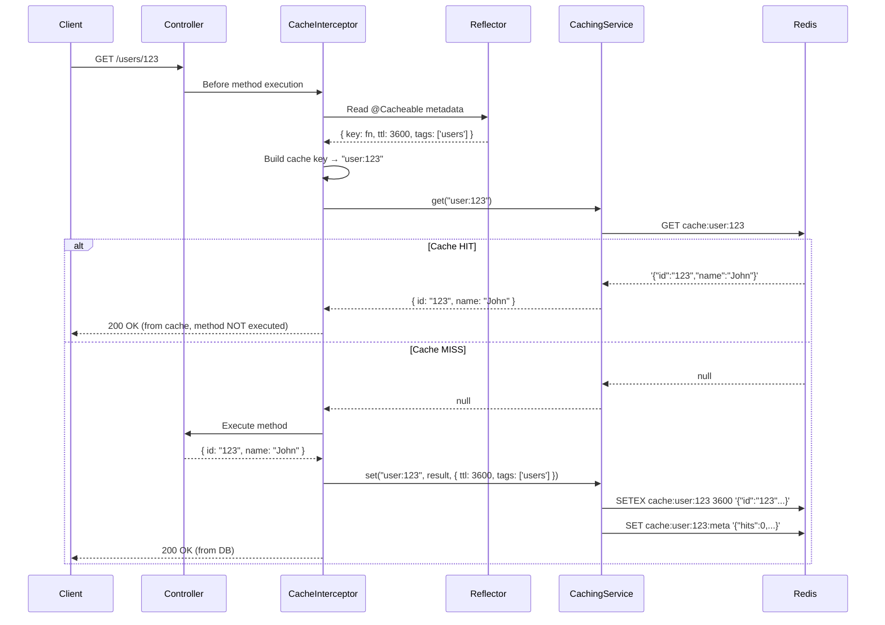
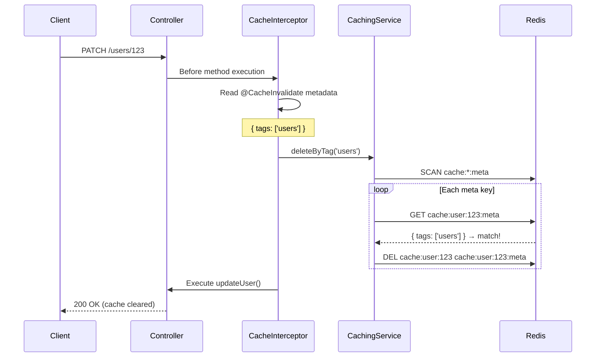
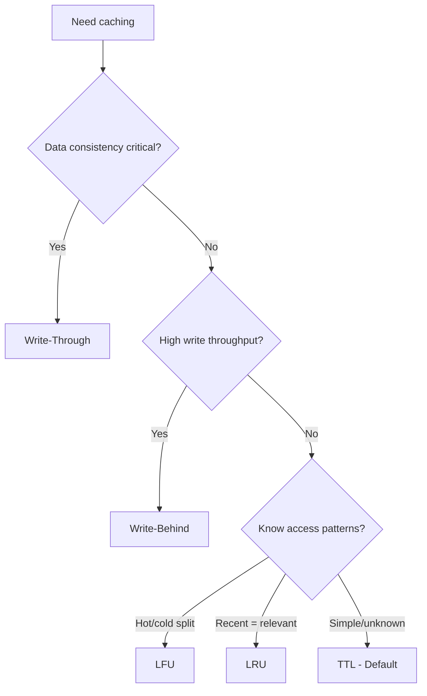

# Technical Design Document: Caching Module

## 1. Overview

The Caching module provides a Redis-backed caching layer for all backend services. It supports 6 cache strategies (TTL, LRU, LFU, Write-Through, Write-Behind, Cache-Aside), automatic caching via decorators + interceptor, tag-based invalidation, metadata tracking, and cache warmup.

**Source location:** `apps/api-gateway/src/shared/caching/` (most complete version with decorators/interceptor)

## 2. Architecture

### 2.1 Component Overview

```
caching/
├── caching.module.ts              # NestJS module registration (@Global)
├── caching.service.ts             # Core logic: get/set/delete + 6 strategies + eviction
├── redis-config.service.ts        # Redis connection config from env variables
├── decorators/
│   └── cacheable.decorator.ts     # @Cacheable(), @CacheInvalidate(), CacheKeyBuilders
└── interceptors/
    └── cache.interceptor.ts       # Auto cache/invalidate based on decorator metadata
```

### 2.2 How Components Work Together



### 2.3 Cache Invalidation Flow



## 3. Theory: Caching Strategies

### 3.1 What is Caching?

Caching is like keeping a notepad on your desk. Instead of walking to the filing cabinet (database) every time you need information, you write frequently used info on your notepad (Redis). It's faster but the notepad has limited space.

### 3.2 The 6 Strategies

#### TTL (Time To Live) — Default

**Concept:** Store data with an expiration time. After TTL expires, data is automatically deleted.

**Real-world analogy:** A sticky note that self-destructs after 1 hour.

```
SET "user:123" → { name: "John" }  TTL: 3600s
                                        │
   0s ────────────── 3600s ─────────────┘
   ↑ stored          ↑ auto-deleted by Redis
```

**How it works in code:**
```typescript
await redis.setex('cache:user:123', 3600, '{"name":"John"}');
// Redis automatically deletes after 3600 seconds
```

**Pros:** Simple, predictable, Redis handles cleanup
**Cons:** Data can become stale before TTL expires

**Best for:** Most use cases. API responses, user profiles, config data.

---

#### LRU (Least Recently Used)

**Concept:** Track when each entry was last accessed. When cache is full (>10k keys), evict the 10% that haven't been accessed for the longest time.

**Real-world analogy:** A bookshelf with limited space. When full, remove books you haven't read in the longest time.

```
Access order: A, B, C, D, E (A is oldest)
Cache full → evict A (least recently used)

Before: [A(old) B C D E]
After:  [B C D E F(new)]
```

**How it works in code:**
- Uses Redis Sorted Set `cache:lru` with timestamp as score
- On every access: `ZADD cache:lru {timestamp} {key}`
- On eviction: `ZRANGE cache:lru 0 {10%}` → delete oldest keys

**Pros:** Keeps frequently accessed data warm
**Cons:** Extra Redis operations per access (Sorted Set update)

**Best for:** Data with varying access patterns. Hot data stays, cold data gets evicted.

---

#### LFU (Least Frequently Used)

**Concept:** Track how many times each entry is accessed. When cache is full, evict the 10% with the lowest access count.

**Real-world analogy:** A library tracking how many times each book is borrowed. Remove least borrowed books first.

```
Access counts: A(50), B(3), C(100), D(1), E(20)
Cache full → evict D(1) then B(3) (least frequently used)
```

**How it works in code:**
- Uses Redis Sorted Set `cache:lfu` with frequency as score
- On every access: `ZINCRBY cache:lfu 1 {key}`
- On eviction: `ZRANGE cache:lfu 0 {10%}` → delete least used keys

**Pros:** Better for workloads with clear hot/cold data separation
**Cons:** New entries risk being evicted before building up frequency

**Best for:** Stable access patterns. Dashboard data, popular products.

---

#### Write-Through

**Concept:** Write to cache AND database simultaneously. Reads always come from cache.

```
Write: Client → Cache + DB (both at same time)
Read:  Client → Cache (always up-to-date)
```

**Current implementation:** Stub — only writes to Redis, DB write not implemented.

**Pros:** Cache is always consistent with DB
**Cons:** Write latency (must wait for both cache + DB)

**Best for:** Data that must be consistent. Financial data, user credentials.

---

#### Write-Behind (Write-Back)

**Concept:** Write to cache immediately, write to DB asynchronously later.

```
Write: Client → Cache (instant) → DB (later, async)
Read:  Client → Cache
```

**Current implementation:** Not implemented (enum only).

**Pros:** Fast writes, reduced DB load
**Cons:** Risk of data loss if cache fails before DB write

**Best for:** High write throughput. Analytics, logging, counters.

---

#### Cache-Aside (Lazy Loading)

**Concept:** Application manages cache manually. On miss: load from DB, write to cache. On write: update DB, invalidate cache.

```
Read (miss):  App → Cache (miss) → DB → Cache (store) → return
Read (hit):   App → Cache (hit) → return
Write:        App → DB → Cache (invalidate)
```

**How it works in code:** Same as TTL storage — the pattern is about when/how you call get/set, not how Redis stores the data.

**Pros:** Only caches data that's actually needed
**Cons:** First request always slow (cold start)

**Best for:** Read-heavy workloads where not all data is frequently accessed.

### 3.3 Strategy Comparison

| Strategy | Write Speed | Read Speed | Consistency | Memory Efficiency |
|----------|-----------|-----------|-------------|-------------------|
| TTL | Fast | Fast | Low (stale until expire) | Medium |
| LRU | Medium | Fast | Low | High (auto-evict cold) |
| LFU | Medium | Fast | Low | High (auto-evict rare) |
| Write-Through | Slow | Fast | High | Low (cache everything) |
| Write-Behind | Fast | Fast | Medium (async lag) | Low |
| Cache-Aside | Fast | Fast (hit) / Slow (miss) | Medium | High (only cache used) |

### 3.4 Decision Guide



## 4. Decorator + Interceptor Pattern

### 4.1 How They Connect

```
@Cacheable()  ──→ SetMetadata('cacheable', config)  ──→ stored on method
                                                            │
CacheInterceptor ──→ Reflector.get('cacheable')  ←─────────┘
                          │
                     CachingService.get() / .set()
```

The decorator does NOT cache anything — it only attaches config as metadata. The interceptor reads that metadata and executes the caching logic.

### 4.2 @Cacheable Config Options

| Option | Type | Description |
|--------|------|-------------|
| `key` | `string \| (args) => string` | Cache key. Static string or function that builds key from method args |
| `ttl` | `number` | Time to live in seconds |
| `strategy` | `CacheStrategy` | Which eviction strategy to use |
| `tags` | `string[]` | Tags for group invalidation |
| `condition` | `(args) => boolean` | Only cache if condition returns true |

### 4.3 @CacheInvalidate Config Options

| Option | Type | Description |
|--------|------|-------------|
| `keys` | `string \| string[] \| (args) => string \| string[]` | Specific keys to invalidate |
| `tags` | `string \| string[]` | Delete all entries with matching tags |
| `allEntries` | `boolean` | Clear entire cache |

### 4.4 CacheKeyBuilders

Utility class to generate key functions. **Important limitation:** at controller level, `args[0]` is the Express Request object, not the method parameter.

| Method | What it does | Works at controller level? |
|--------|-------------|--------------------------|
| `fromArgs(prefix)` | Key from all args | No — serializes entire Request object |
| `fromArg(prefix, index)` | Key from args[index] | No — args[0] is Request |
| `fromProperty(prefix, index, prop)` | Key from args[index][prop] | No — only 1 level deep, can't do `params.id` |

**Recommended approach at controller level:** Use inline arrow functions:

```typescript
@Cacheable({
  key: (args) => `user:${args[0]?.params?.id}`,
  ttl: 3600,
  tags: ['users'],
})
```

## 5. Redis Key Structure

Every cache entry creates 2 Redis keys:

| Key | Purpose | Example |
|-----|---------|---------|
| `cache:{key}` | The actual cached data | `cache:user:123` → `'{"id":"123","name":"John"}'` |
| `cache:{key}:meta` | Metadata (hits, timestamps, tags) | `cache:user:123:meta` → `'{"hits":5,"tags":["users"],...}'` |

Additional keys for eviction tracking:

| Key | Strategy | Data Structure |
|-----|----------|---------------|
| `cache:lru` | LRU | Sorted Set: score = last access timestamp |
| `cache:lfu` | LFU | Sorted Set: score = access frequency count |

## 6. Eviction Behavior

When using LRU or LFU strategies, eviction triggers automatically when total keys exceed 10,000:

```
Keys: 10,001 → evict 10% (1,000 keys)
       │
       ├─ LRU: remove 1,000 entries with oldest lastAccessed timestamp
       └─ LFU: remove 1,000 entries with lowest access frequency
```

TTL strategy relies on Redis native expiration — no application-level eviction needed.

## 7. Practical Usage

### 7.1 Direct Service Usage (Recommended for complex cases)

```typescript
@Injectable()
export class UsersService {
  constructor(private cachingService: CachingService) {}

  async getUserById(id: string): Promise<User> {
    const cacheKey = `user:${id}`;

    // Try cache first
    const cached = await this.cachingService.get<User>(cacheKey);
    if (cached) return cached;

    // Cache miss — query DB
    const user = await this.userRepository.findOne({ where: { id } });

    // Store in cache
    await this.cachingService.set(cacheKey, user, {
      ttl: 3600,
      tags: ['users'],
    });

    return user;
  }

  async updateUser(id: string, data: UpdateUserDto): Promise<User> {
    const user = await this.userRepository.save({ id, ...data });

    // Invalidate specific key
    await this.cachingService.delete(`user:${id}`);

    // Or invalidate all users cache
    await this.cachingService.deleteByTag('users');

    return user;
  }
}
```

### 7.2 Decorator Usage (Simple GET endpoints)

```typescript
@Controller('users')
@UseInterceptors(CacheInterceptor)
export class UsersController {
  @Get(':id')
  @Cacheable({
    key: (args) => `user:${args[0]?.params?.id}`,
    ttl: 3600,
    tags: ['users'],
  })
  async getUser(@Param('id') id: string) { ... }

  @Patch(':id')
  @CacheInvalidate({ tags: ['users'] })
  async updateUser(@Param('id') id: string, @Body() dto: UpdateUserDto) { ... }

  @Delete(':id')
  @CacheInvalidate({
    keys: (args) => `user:${args[0]?.params?.id}`,
  })
  async deleteUser(@Param('id') id: string) { ... }
}
```

### 7.3 Cache Warmup (On app startup)

```typescript
// In a service or module onModuleInit
async onModuleInit() {
  const popularUsers = await this.userRepository.find({
    order: { lastLogin: 'DESC' },
    take: 100,
  });

  await this.cachingService.warmup(
    popularUsers.map(user => ({
      key: `user:${user.id}`,
      value: user,
      ttl: 7200,
    })),
  );
}
```

### 7.4 Cache Statistics

```typescript
const stats = await this.cachingService.getStats();
// {
//   hits: 1520,
//   misses: 380,
//   hitRate: 80.00,        // percentage
//   totalKeys: 245,
//   memoryUsed: 1048576,   // bytes
//   evictions: 12,
// }
```

## 8. Module Differences Across Apps

| Feature | `apps/api` | `apps/api-gateway` | `apps/auth-service` |
|---------|-----------|-------------------|-------------------|
| CachingService | Yes | Yes | Yes |
| @Cacheable decorator | No | Yes | Yes |
| @CacheInvalidate decorator | No | Yes | Yes |
| CacheInterceptor | No | Yes | Yes |
| CacheKeyBuilders | No | Yes | Yes |

`apps/api` only has the service — use direct `get()/set()` calls. The other apps have the full decorator + interceptor pattern.

## 9. Open Questions

- `CacheKeyBuilders` is designed for service-layer args but the interceptor runs at controller level where `args[0]` is the Request object. The utility is effectively unusable in its current context. Consider removing or redesigning for controller-level usage.
- `WRITE_THROUGH` and `CACHE_ASIDE` strategies have identical Redis storage logic — the difference is in when/how the application calls them, not in the service implementation.
- `WRITE_BEHIND` is defined in the enum but has no implementation.
- Metadata keys (`cache:{key}:meta`) inherit TTL from the data key, but if the data key has no TTL (LRU/LFU), the metadata key also has no TTL and may accumulate indefinitely.
- In-memory stats (`hits`, `misses`, `evictions`) are per-instance and reset on restart. For production monitoring, these should be persisted in Redis.
