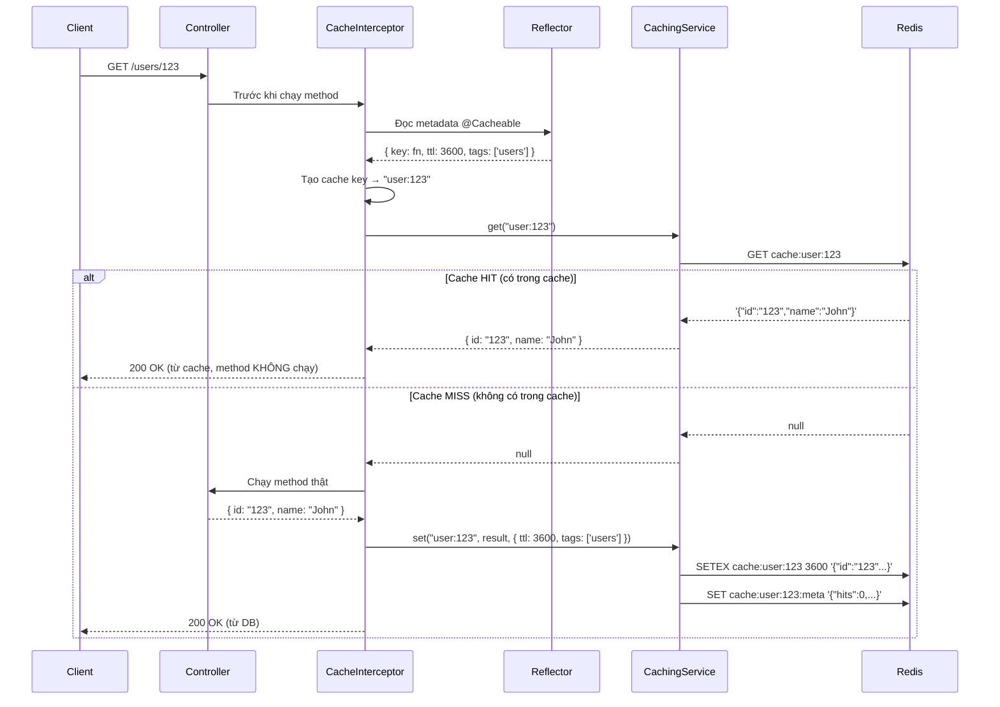
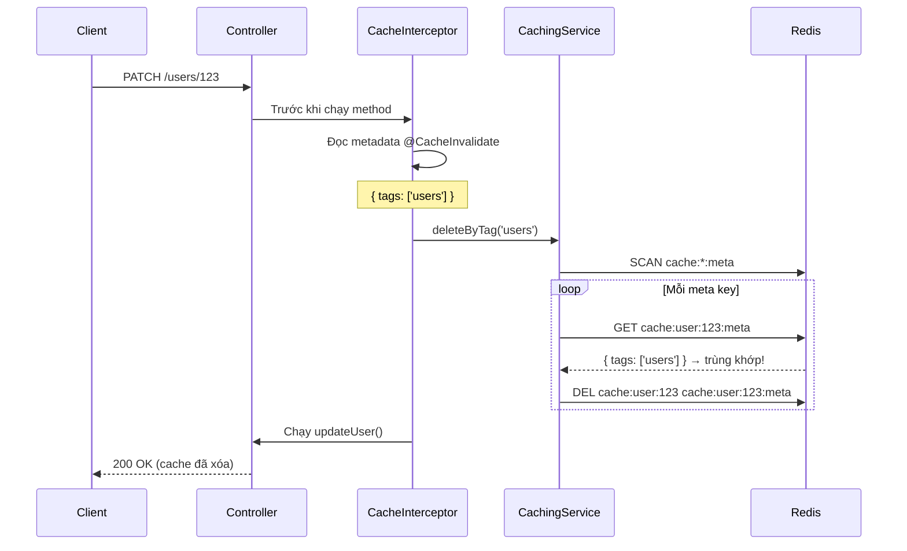
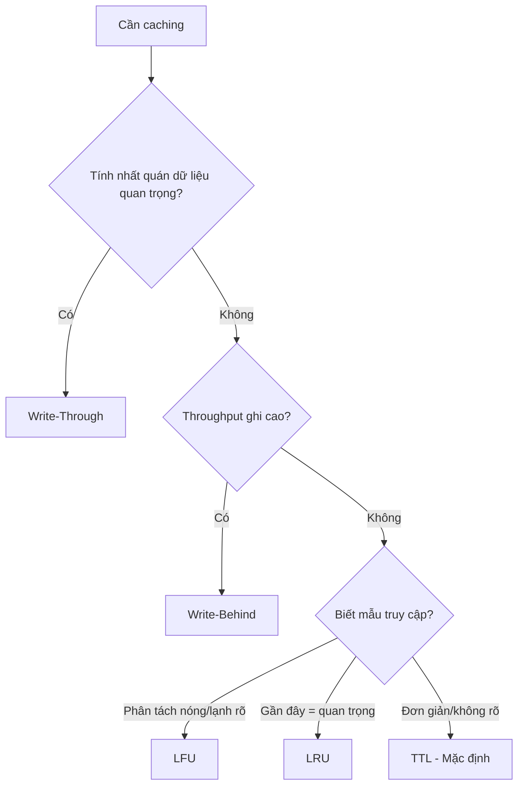

# Tài liệu Thiết kế: Caching Module

## 1. Tổng quan

Caching module cung cấp tầng cache dựa trên Redis cho tất cả các backend service. Module hỗ trợ 6 chiến lược cache (TTL, LRU, LFU, Write-Through, Write-Behind, Cache-Aside), tự động cache qua decorator + interceptor, xóa cache theo tag, theo dõi metadata, và cache warmup.

**Vị trí source:** `apps/api-gateway/src/shared/caching/` (phiên bản đầy đủ nhất với decorator/interceptor)

## 2. Kiến trúc

### 2.1 Cấu trúc thư mục

```
caching/
├── caching.module.ts              # Đăng ký NestJS module (@Global)
├── caching.service.ts             # Logic chính: get/set/delete + 6 chiến lược + eviction
├── redis-config.service.ts        # Cấu hình kết nối Redis từ biến môi trường
├── decorators/
│   └── cacheable.decorator.ts     # @Cacheable(), @CacheInvalidate(), CacheKeyBuilders
└── interceptors/
    └── cache.interceptor.ts       # Tự động cache/xóa cache dựa trên metadata của decorator
```

### 2.2 Các thành phần làm việc với nhau như thế nào



### 2.3 Luồng xóa Cache (Invalidation)



## 3. Lý thuyết: Các chiến lược Caching

### 3.1 Caching là gì?

Caching giống như giữ một quyển sổ tay trên bàn. Thay vì phải đi đến tủ hồ sơ (database) mỗi khi cần thông tin, bạn ghi những thông tin hay dùng vào sổ tay (Redis). Nhanh hơn nhưng sổ tay có giới hạn chỗ.

### 3.2 6 chiến lược

#### TTL (Time To Live) — Mặc định

**Khái niệm:** Lưu dữ liệu với thời gian hết hạn. Sau khi TTL hết, dữ liệu tự động bị xóa.

**Ví dụ thực tế:** Một tờ giấy nhớ tự hủy sau 1 giờ.

```
SET "user:123" → { name: "John" }  TTL: 3600 giây
                                        │
   0s ────────────── 3600s ─────────────┘
   ↑ lưu vào          ↑ Redis tự xóa
```

**Cách hoạt động trong code:**

```typescript
await redis.setex("cache:user:123", 3600, '{"name":"John"}');
// Redis tự động xóa sau 3600 giây
```

**Ưu điểm:** Đơn giản, dễ đoán, Redis tự dọn dẹp
**Nhược điểm:** Dữ liệu có thể bị cũ (stale) trước khi TTL hết

**Phù hợp với:** Hầu hết các trường hợp. Response API, thông tin user, dữ liệu cấu hình.

---

#### LRU (Least Recently Used — Ít được truy cập gần đây nhất)

**Khái niệm:** Theo dõi thời điểm mỗi entry được truy cập lần cuối. Khi cache đầy (>10k key), xóa 10% entry không được truy cập lâu nhất.

**Ví dụ thực tế:** Một kệ sách có giới hạn chỗ. Khi đầy, bỏ những cuốn sách bạn chưa đọc lâu nhất.

```
Thứ tự truy cập: A, B, C, D, E (A là cũ nhất)
Cache đầy → xóa A (ít được truy cập gần đây nhất)

Trước: [A(cũ) B C D E]
Sau:   [B C D E F(mới)]
```

**Cách hoạt động trong code:**

- Dùng Redis Sorted Set `cache:lru` với timestamp làm score
- Mỗi lần truy cập: `ZADD cache:lru {timestamp} {key}`
- Khi evict: `ZRANGE cache:lru 0 {10%}` → xóa key cũ nhất

**Ưu điểm:** Giữ dữ liệu hay dùng ở trong cache
**Nhược điểm:** Tốn thêm thao tác Redis mỗi lần truy cập (cập nhật Sorted Set)

**Phù hợp với:** Dữ liệu có mẫu truy cập thay đổi. Dữ liệu "nóng" ở lại, dữ liệu "lạnh" bị xóa.

---

#### LFU (Least Frequently Used — Ít được truy cập thường xuyên nhất)

**Khái niệm:** Theo dõi số lần mỗi entry được truy cập. Khi cache đầy, xóa 10% entry có số lần truy cập thấp nhất.

**Ví dụ thực tế:** Thư viện theo dõi số lần mỗi cuốn sách được mượn. Bỏ những cuốn ít được mượn nhất trước.

```
Số lần truy cập: A(50), B(3), C(100), D(1), E(20)
Cache đầy → xóa D(1) rồi B(3) (ít được dùng nhất)
```

**Cách hoạt động trong code:**

- Dùng Redis Sorted Set `cache:lfu` với tần suất làm score
- Mỗi lần truy cập: `ZINCRBY cache:lfu 1 {key}`
- Khi evict: `ZRANGE cache:lfu 0 {10%}` → xóa key ít dùng nhất

**Ưu điểm:** Tốt cho workload có sự phân biệt rõ dữ liệu nóng/lạnh
**Nhược điểm:** Entry mới có nguy cơ bị xóa trước khi kịp tích lũy tần suất

**Phù hợp với:** Mẫu truy cập ổn định. Dữ liệu dashboard, sản phẩm phổ biến.

---

#### Write-Through (Ghi xuyên suốt)

**Khái niệm:** Ghi vào cache VÀ database đồng thời. Đọc luôn lấy từ cache.

```
Ghi:  Client → Cache + DB (cùng lúc)
Đọc:  Client → Cache (luôn cập nhật)
```

**Triển khai hiện tại:** Stub — chỉ ghi vào Redis, chưa ghi DB.

**Ưu điểm:** Cache luôn đồng nhất với DB
**Nhược điểm:** Ghi chậm (phải đợi cả cache + DB)

**Phù hợp với:** Dữ liệu cần đồng nhất. Dữ liệu tài chính, thông tin đăng nhập.

---

#### Write-Behind (Ghi sau)

**Khái niệm:** Ghi vào cache ngay lập tức, ghi vào DB bất đồng bộ sau.

```
Ghi:  Client → Cache (ngay) → DB (sau, bất đồng bộ)
Đọc:  Client → Cache
```

**Triển khai hiện tại:** Chưa triển khai (chỉ có trong enum).

**Ưu điểm:** Ghi nhanh, giảm tải DB
**Nhược điểm:** Rủi ro mất dữ liệu nếu cache hỏng trước khi ghi DB

**Phù hợp với:** Throughput ghi cao. Analytics, logging, bộ đếm.

---

#### Cache-Aside (Lazy Loading — Tải lười)

**Khái niệm:** Ứng dụng quản lý cache thủ công. Khi miss: load từ DB, ghi vào cache. Khi ghi: cập nhật DB, xóa cache.

```
Đọc (miss):  App → Cache (miss) → DB → Cache (lưu) → trả về
Đọc (hit):   App → Cache (hit) → trả về
Ghi:         App → DB → Cache (xóa)
```

**Cách hoạt động trong code:** Lưu trữ Redis giống TTL — sự khác biệt nằm ở việc khi nào/cách nào bạn gọi get/set, không phải cách Redis lưu dữ liệu.

**Ưu điểm:** Chỉ cache dữ liệu thực sự được dùng
**Nhược điểm:** Request đầu tiên luôn chậm (cold start)

**Phù hợp với:** Workload đọc nhiều mà không phải tất cả dữ liệu đều được truy cập thường xuyên.

### 3.3 So sánh chiến lược

| Chiến lược    | Tốc độ ghi | Tốc độ đọc                | Tính nhất quán                | Hiệu quả bộ nhớ           |
| ------------- | ---------- | ------------------------- | ----------------------------- | ------------------------- |
| TTL           | Nhanh      | Nhanh                     | Thấp (cũ cho đến khi hết hạn) | Trung bình                |
| LRU           | Trung bình | Nhanh                     | Thấp                          | Cao (tự xóa dữ liệu lạnh) |
| LFU           | Trung bình | Nhanh                     | Thấp                          | Cao (tự xóa dữ liệu hiếm) |
| Write-Through | Chậm       | Nhanh                     | Cao                           | Thấp (cache mọi thứ)      |
| Write-Behind  | Nhanh      | Nhanh                     | Trung bình (trễ bất đồng bộ)  | Thấp                      |
| Cache-Aside   | Nhanh      | Nhanh (hit) / Chậm (miss) | Trung bình                    | Cao (chỉ cache cái dùng)  |

### 3.4 Hướng dẫn chọn chiến lược



## 4. Pattern Decorator + Interceptor

### 4.1 Cách chúng kết nối với nhau

```
@Cacheable()  ──→ SetMetadata('cacheable', config)  ──→ lưu trên method
                                                            │
CacheInterceptor ──→ Reflector.get('cacheable')  ←─────────┘
                          │
                     CachingService.get() / .set()
```

Decorator KHÔNG cache gì cả — nó chỉ gắn config dưới dạng metadata. Interceptor đọc metadata đó và thực thi logic caching.

### 4.2 Tùy chọn @Cacheable

| Tùy chọn    | Kiểu                         | Mô tả                                                  |
| ----------- | ---------------------------- | ------------------------------------------------------ |
| `key`       | `string \| (args) => string` | Cache key. Chuỗi cố định hoặc function tạo key từ args |
| `ttl`       | `number`                     | Thời gian sống tính bằng giây                          |
| `strategy`  | `CacheStrategy`              | Chiến lược eviction nào sẽ dùng                        |
| `tags`      | `string[]`                   | Tag để xóa cache theo nhóm                             |
| `condition` | `(args) => boolean`          | Chỉ cache nếu điều kiện trả về true                    |

### 4.3 Tùy chọn @CacheInvalidate

| Tùy chọn     | Kiểu                                                 | Mô tả                              |
| ------------ | ---------------------------------------------------- | ---------------------------------- |
| `keys`       | `string \| string[] \| (args) => string \| string[]` | Key cụ thể cần xóa                 |
| `tags`       | `string \| string[]`                                 | Xóa tất cả entry có tag trùng khớp |
| `allEntries` | `boolean`                                            | Xóa toàn bộ cache                  |

### 4.4 CacheKeyBuilders

Lớp tiện ích để tạo function cho cache key. **Hạn chế quan trọng:** ở tầng controller, `args[0]` là Express Request object, không phải parameter của method.

| Method                              | Chức năng                | Dùng được ở controller?                            |
| ----------------------------------- | ------------------------ | -------------------------------------------------- |
| `fromArgs(prefix)`                  | Key từ tất cả args       | Không — serialize cả Request object                |
| `fromArg(prefix, index)`            | Key từ args[index]       | Không — args[0] là Request                         |
| `fromProperty(prefix, index, prop)` | Key từ args[index][prop] | Không — chỉ 1 cấp, không truy cập được `params.id` |

**Cách khuyến nghị ở tầng controller:** Dùng inline arrow function:

```typescript
@Cacheable({
  key: (args) => `user:${args[0]?.params?.id}`,
  ttl: 3600,
  tags: ['users'],
})
```

## 5. Cấu trúc Redis Key

Mỗi cache entry tạo 2 Redis key:

| Key                | Mục đích                          | Ví dụ                                                       |
| ------------------ | --------------------------------- | ----------------------------------------------------------- |
| `cache:{key}`      | Dữ liệu cache thật                | `cache:user:123` → `'{"id":"123","name":"John"}'`           |
| `cache:{key}:meta` | Metadata (hits, timestamps, tags) | `cache:user:123:meta` → `'{"hits":5,"tags":["users"],...}'` |

Key bổ sung cho việc theo dõi eviction:

| Key         | Chiến lược | Cấu trúc dữ liệu                            |
| ----------- | ---------- | ------------------------------------------- |
| `cache:lru` | LRU        | Sorted Set: score = timestamp truy cập cuối |
| `cache:lfu` | LFU        | Sorted Set: score = số lần truy cập         |

## 6. Hành vi Eviction

Khi dùng chiến lược LRU hoặc LFU, eviction tự động kích hoạt khi tổng số key vượt 10.000:

```
Số key: 10.001 → xóa 10% (1.000 key)
       │
       ├─ LRU: xóa 1.000 entry có timestamp truy cập cũ nhất
       └─ LFU: xóa 1.000 entry có số lần truy cập thấp nhất
```

Chiến lược TTL dựa vào cơ chế hết hạn tự nhiên của Redis — không cần eviction ở tầng ứng dụng.

## 7. Áp dụng thực tế

### 7.1 Dùng Service trực tiếp (Khuyến nghị cho logic phức tạp)

```typescript
@Injectable()
export class UsersService {
  constructor(private cachingService: CachingService) {}

  async getUserById(id: string): Promise<User> {
    const cacheKey = `user:${id}`;

    // Thử cache trước
    const cached = await this.cachingService.get<User>(cacheKey);
    if (cached) return cached;

    // Cache miss — query DB
    const user = await this.userRepository.findOne({ where: { id } });

    // Lưu vào cache
    await this.cachingService.set(cacheKey, user, {
      ttl: 3600,
      tags: ["users"],
    });

    return user;
  }

  async updateUser(id: string, data: UpdateUserDto): Promise<User> {
    const user = await this.userRepository.save({ id, ...data });

    // Xóa cache cụ thể
    await this.cachingService.delete(`user:${id}`);

    // Hoặc xóa toàn bộ cache users
    await this.cachingService.deleteByTag("users");

    return user;
  }
}
```

### 7.2 Dùng Decorator (Cho endpoint GET đơn giản)

```typescript
@Controller('users')
@UseInterceptors(CacheInterceptor)
export class UsersController {
  @Get(':id')
  @Cacheable({
    key: (args) => `user:${args[0]?.params?.id}`,
    ttl: 3600,
    tags: ['users'],
  })
  async getUser(@Param('id') id: string) { ... }

  @Patch(':id')
  @CacheInvalidate({ tags: ['users'] })
  async updateUser(@Param('id') id: string, @Body() dto: UpdateUserDto) { ... }

  @Delete(':id')
  @CacheInvalidate({
    keys: (args) => `user:${args[0]?.params?.id}`,
  })
  async deleteUser(@Param('id') id: string) { ... }
}
```

### 7.3 Cache Warmup (Khi app khởi động)

```typescript
// Trong service hoặc module onModuleInit
async onModuleInit() {
  const popularUsers = await this.userRepository.find({
    order: { lastLogin: 'DESC' },
    take: 100,
  });

  await this.cachingService.warmup(
    popularUsers.map(user => ({
      key: `user:${user.id}`,
      value: user,
      ttl: 7200,
    })),
  );
}
```

### 7.4 Thống kê Cache

```typescript
const stats = await this.cachingService.getStats();
// {
//   hits: 1520,           // Số lần tìm thấy trong cache
//   misses: 380,          // Số lần không tìm thấy
//   hitRate: 80.00,       // Phần trăm hit
//   totalKeys: 245,       // Tổng số key trong cache
//   memoryUsed: 1048576,  // Bytes
//   evictions: 12,        // Số lần bị xóa do eviction
// }
```

## 8. Sự khác biệt giữa các App

| Tính năng                  | `apps/api` | `apps/api-gateway` | `apps/auth-service` |
| -------------------------- | ---------- | ------------------ | ------------------- |
| CachingService             | Có         | Có                 | Có                  |
| @Cacheable decorator       | Không      | Có                 | Có                  |
| @CacheInvalidate decorator | Không      | Có                 | Có                  |
| CacheInterceptor           | Không      | Có                 | Có                  |
| CacheKeyBuilders           | Không      | Có                 | Có                  |

`apps/api` chỉ có service — dùng trực tiếp `get()/set()`. Các app còn lại có đầy đủ pattern decorator + interceptor.

## 9. Câu hỏi mở

- `CacheKeyBuilders` được thiết kế cho args ở tầng service nhưng interceptor chạy ở tầng controller nơi `args[0]` là Request object. Utility này gần như không dùng được trong context hiện tại. Cần xem xét xóa bỏ hoặc thiết kế lại cho phù hợp tầng controller.
- Chiến lược `WRITE_THROUGH` và `CACHE_ASIDE` có logic lưu trữ Redis giống hệt nhau — sự khác biệt nằm ở việc khi nào/cách nào ứng dụng gọi chúng, không phải trong triển khai service.
- `WRITE_BEHIND` được định nghĩa trong enum nhưng chưa có triển khai.
- Metadata key (`cache:{key}:meta`) kế thừa TTL từ data key, nhưng nếu data key không có TTL (LRU/LFU), metadata key cũng không có TTL và có thể tích lũy vô hạn.
- Thống kê trong bộ nhớ (`hits`, `misses`, `evictions`) là per-instance và reset khi restart. Cho production, nên lưu vào Redis.
