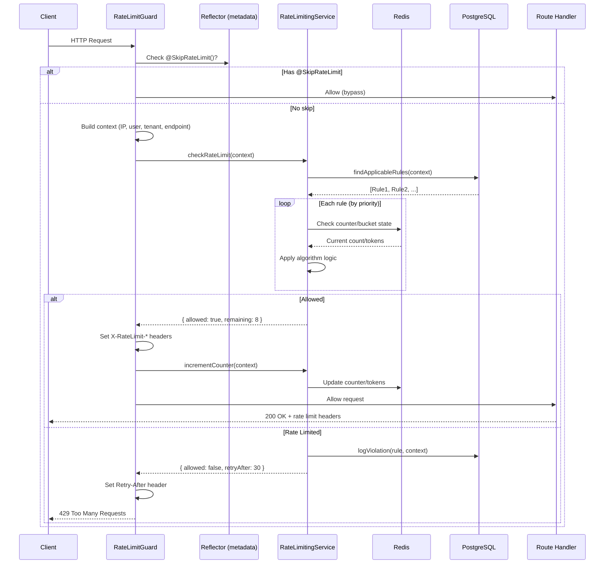
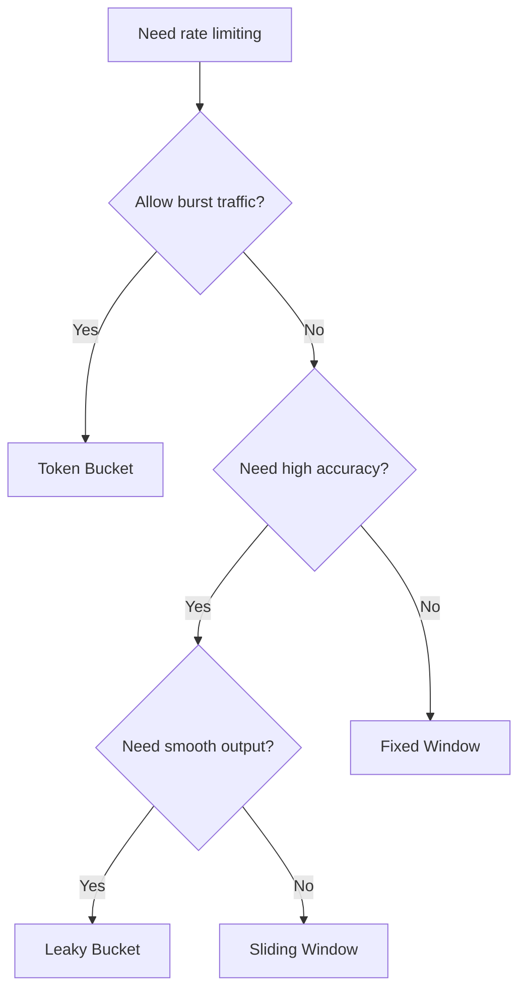
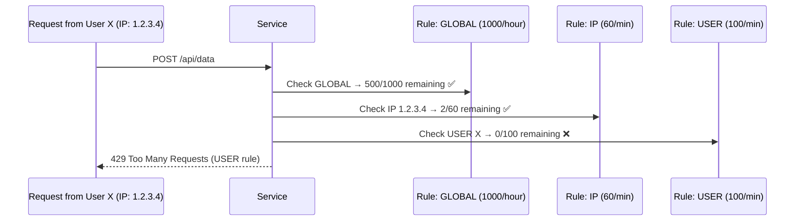
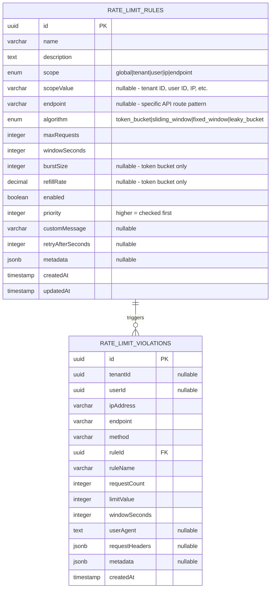

# Technical Design Document: Rate Limiting Module

## 1. Overview

The Rate Limiting module protects backend services from abuse, DDoS attacks, and excessive usage by controlling how many requests a client can make within a time window. It is implemented as a shared NestJS module with Redis-backed state tracking, supports 4 industry-standard algorithms, and provides multi-scope rate limiting (global, tenant, user, IP, endpoint).

**Source location:** `apps/api-gateway/src/shared/rate-limiting/`

## 2. Architecture

### 2.1 Component Overview

```
rate-limiting/
├── rate-limiting.module.ts            # NestJS module registration
├── rate-limiting.service.ts           # Core logic + 4 algorithms
├── rate-limiting.controller.ts        # Admin REST API
├── guards/
│   └── rate-limit.guard.ts            # NestJS Guard (auto-applies rate limiting)
├── decorators/
│   └── rate-limit.decorator.ts        # @RateLimit(), @SkipRateLimit(), presets
├── entities/
│   ├── rate-limit-rule.entity.ts      # DB: rate limit rules configuration
│   └── rate-limit-violation.entity.ts # DB: violation logs
└── dto/
    └── create-rate-limit-rule.dto.ts  # Validation for API input
```

### 2.2 How Components Work Together



## 3. Theory: Rate Limiting Algorithms

### 3.1 What is Rate Limiting?

Rate limiting is like a bouncer at a club. The club has a maximum capacity. Once full, new people must wait. Different bouncers have different rules for counting and letting people in.

### 3.2 The 4 Algorithms

#### Fixed Window

**Concept:** Divide time into fixed intervals (windows). Count requests in each window. Reset counter when window ends.

**Real-world analogy:** A parking lot that resets its counter every hour. At 2:00 PM it resets to 0, at 3:00 PM it resets again.

```
Window 1 (00:00-01:00)    Window 2 (01:00-02:00)
[||||||||..] 8/10          [|||.......] 3/10
             ↑ 2 remaining              ↑ 7 remaining
                    ↑ counter resets here
```

**How it works in code** (`checkFixedWindow`):

1. Calculate which window we're in: `currentWindow = floor(now / windowMs)`
2. Redis key: `ratelimit:{ruleId}:{scope}:{currentWindow}`
3. Get counter from Redis → check if < maxRequests

**Pros:** Simple, low memory usage (1 Redis key per window)
**Cons:** Boundary problem — a client can send 2x requests at window boundary:

```
Window 1: ....||||||| (10 requests at 00:59)
Window 2: |||||||.... (10 requests at 01:00)
= 20 requests in 2 seconds, but limit is 10/minute
```

**Best for:** Simple use cases, login attempts (AUTH preset: 5 req/min)

---

#### Sliding Window

**Concept:** Instead of fixed boundaries, the window "slides" with time. Count requests in the last N seconds from now.

**Real-world analogy:** A restaurant that says "max 10 people in the last 60 minutes". At any point, it counts everyone who entered in the past hour.

```
Time: ──────[===========60s window===========]──────>
                    ↑ count requests in this range
             (requests older than 60s are removed)
```

**How it works in code** (`checkSlidingWindow`):

1. Uses Redis Sorted Set — each request stored with timestamp as score
2. Remove old entries: `ZREMRANGEBYSCORE key 0 (now - windowMs)`
3. Count remaining: `ZCARD key`
4. If count < maxRequests → allowed

**Pros:** No boundary problem, smooth rate limiting
**Cons:** Higher memory (stores every request timestamp)

**Best for:** API rate limiting, public endpoints (STANDARD: 60 req/min, API: 1000 req/hour)

---

#### Token Bucket

**Concept:** Imagine a bucket filled with tokens. Each request consumes 1 token. Tokens refill at a constant rate. Bucket has a max capacity (burst size).

**Real-world analogy:** A bus pass with 10 rides. You use 1 ride per trip. Every hour, 2 rides are added back (up to max 10).

```
Bucket capacity: 10 tokens, refill: 2 tokens/sec

Time 0:  [TTTTTTTTTT] 10 tokens  (full)
Burst:   [TTTT......] 4 tokens   (6 requests used)
Wait 3s: [TTTTTTTTTT] 10 tokens  (refilled: 4 + 2*3 = 10, capped)
```

**How it works in code** (`checkTokenBucket`):

1. Redis stores: `{ tokens: number, lastRefill: timestamp }`
2. On check: calculate tokens to add based on elapsed time
3. `tokens = min(burstSize, tokens + elapsed * refillRate)`
4. If tokens >= 1 → allowed, consume 1 token

**Pros:** Allows burst traffic, smooth average rate
**Cons:** Slightly more complex state

**Best for:** APIs that need burst tolerance (RELAXED: 300 req/min, BURST: 100 req/min)

---

#### Leaky Bucket

**Concept:** Requests enter a bucket (queue). The bucket "leaks" at a constant rate. If bucket is full, new requests are rejected.

**Real-world analogy:** A funnel. You pour water in (requests). Water drips out at a constant rate. If you pour too fast, the funnel overflows (rejected).

```
                Requests in
                    ↓
               ┌─────────┐
               │  Queue   │ ← bucket capacity = maxRequests
               │  |||     │
               └────┬────┘
                    ↓ leak rate = maxRequests / windowSeconds
               Processed
```

**How it works in code** (`checkLeakyBucket`):

1. Redis stores: `{ queueSize: number, lastLeak: timestamp }`
2. On check: calculate leaked requests based on elapsed time
3. `queueSize = max(0, queueSize - elapsed * leakRate)`
4. If queueSize < maxRequests → allowed, add 1 to queue

**Pros:** Perfectly smooth output rate, no bursts
**Cons:** Strict — no burst tolerance

**Best for:** Scenarios where you need constant throughput (payment processing, write-heavy APIs)

### 3.3 Algorithm Comparison

| Algorithm      | Burst Tolerance        | Memory                | Accuracy | Complexity |
| -------------- | ---------------------- | --------------------- | -------- | ---------- |
| Fixed Window   | No (boundary issue)    | Low (1 counter)       | Low      | Simple     |
| Sliding Window | No                     | High (all timestamps) | High     | Medium     |
| Token Bucket   | Yes (up to burst size) | Low (2 values)        | Medium   | Medium     |
| Leaky Bucket   | No (smooth output)     | Low (2 values)        | High     | Medium     |

### 3.4 Decision Guide



## 4. Scopes: Who Gets Rate Limited?

Rate limiting rules can target different scopes:

| Scope      | What it means                  | Example                      |
| ---------- | ------------------------------ | ---------------------------- |
| `GLOBAL`   | All requests regardless of who | 10000 req/min for entire API |
| `TENANT`   | Per organization/company       | Tenant A: 1000 req/hour      |
| `USER`     | Per authenticated user         | User X: 100 req/min          |
| `IP`       | Per IP address                 | 192.168.1.1: 60 req/min      |
| `ENDPOINT` | Per specific API route         | POST /auth/login: 5 req/min  |

Multiple scopes can apply simultaneously. The **most restrictive rule wins** — if global allows but IP doesn't, request is blocked.



## 5. Practical Application

### 5.1 Using the Guard (Automatic)

Register `RateLimitGuard` globally or per controller:

```typescript
// Global registration in main.ts
app.useGlobalGuards(new RateLimitGuard(reflector, rateLimitingService));

// Or per controller
@Controller('users')
@UseGuards(RateLimitGuard)
export class UsersController { ... }
```

The guard automatically:

1. Extracts IP, user, tenant from the request
2. Queries DB for matching rules
3. Checks Redis counters
4. Sets response headers (`X-RateLimit-Limit`, `X-RateLimit-Remaining`, `X-RateLimit-Reset`)
5. Returns 429 if rate limited

### 5.2 Using Decorators

```typescript
// Skip rate limiting for admin routes
@SkipRateLimit()
@Controller('admin')
export class AdminController { ... }

// Use presets (not yet connected to guard — decorator stores metadata only)
@RateLimit(RateLimitPresets.AUTH)  // 5 req/min, fixed window
@Post('login')
async login() { ... }

@RateLimit(RateLimitPresets.STANDARD)  // 60 req/min, sliding window
@Get('users')
async getUsers() { ... }
```

### 5.3 Creating Rules via API

```bash
# Create a rule: 5 login attempts per minute per IP
curl -X POST http://localhost:3001/api/v1/rate-limiting/rules \
  -H "Content-Type: application/json" \
  -d '{
    "name": "Login Rate Limit",
    "scope": "ip",
    "endpoint": "/auth/login",
    "algorithm": "fixed_window",
    "maxRequests": 5,
    "windowSeconds": 60,
    "priority": 10,
    "customMessage": "Too many login attempts. Try again in 1 minute.",
    "enabled": true
  }'

# Create a global API rate limit
curl -X POST http://localhost:3001/api/v1/rate-limiting/rules \
  -H "Content-Type: application/json" \
  -d '{
    "name": "Global API Limit",
    "scope": "global",
    "algorithm": "sliding_window",
    "maxRequests": 10000,
    "windowSeconds": 3600,
    "priority": 1,
    "enabled": true
  }'
```

### 5.4 Monitoring Violations

```bash
# Get all violations
GET /rate-limiting/violations?limit=50

# Get violations for specific IP
GET /rate-limiting/violations?ipAddress=192.168.1.100

# Check rate limit status for an IP
GET /rate-limiting/status/192.168.1.100?endpoint=/auth/login

# Reset rate limit for an IP (e.g., after support request)
POST /rate-limiting/reset
{ "ipAddress": "192.168.1.100" }
```

### 5.5 Response Headers

Every response includes rate limit information:

```
HTTP/1.1 200 OK
X-RateLimit-Limit: 60          # Max requests allowed
X-RateLimit-Remaining: 45      # Requests remaining in window
X-RateLimit-Reset: 1708300800  # Unix timestamp when window resets

# When rate limited:
HTTP/1.1 429 Too Many Requests
Retry-After: 30                # Seconds until client can retry
X-RateLimit-Limit: 60
X-RateLimit-Remaining: 0
X-RateLimit-Reset: 1708300800
```

## 6. Data Model



## 7. Redis Key Structure

| Algorithm      | Redis Key Pattern                           | Data Structure                                             |
| -------------- | ------------------------------------------- | ---------------------------------------------------------- |
| Token Bucket   | `ratelimit:{ruleId}:{scope}`                | String: `{"tokens": 8, "lastRefill": 1708300000}`          |
| Sliding Window | `ratelimit:{ruleId}:{scope}:requests`       | Sorted Set: score=timestamp, member=`{timestamp}-{random}` |
| Fixed Window   | `ratelimit:{ruleId}:{scope}:{windowNumber}` | String: counter (integer)                                  |
| Leaky Bucket   | `ratelimit:{ruleId}:{scope}`                | String: `{"queueSize": 3, "lastLeak": 1708300000}`         |

All keys have TTL = `windowSeconds * 2` to auto-cleanup.

## 8. Presets Reference

| Preset       | Max Requests | Window | Algorithm      | Use Case                 |
| ------------ | ------------ | ------ | -------------- | ------------------------ |
| `STRICT`     | 10           | 60s    | Sliding Window | Sensitive endpoints      |
| `STANDARD`   | 60           | 60s    | Sliding Window | Normal API usage         |
| `RELAXED`    | 300          | 60s    | Token Bucket   | High-traffic endpoints   |
| `API`        | 1000         | 3600s  | Sliding Window | Hourly API quota         |
| `BURST`      | 100          | 60s    | Token Bucket   | Burst-tolerant endpoints |
| `AUTH`       | 5            | 60s    | Fixed Window   | Login/register           |
| `PUBLIC_API` | 100          | 3600s  | Sliding Window | Public-facing APIs       |

## 9. Open Questions

- The `@RateLimit()` decorator stores metadata but the `RateLimitGuard` currently only reads `@SkipRateLimit()`. The guard uses DB rules rather than decorator config. Should the guard also respect decorator-based config?
- `CacheKeyBuilders` in the caching module has the same limitation — designed for service layer but used at controller layer. Consider aligning the design.
- No warmup or sync mechanism for rate limit state across multiple instances (horizontal scaling). Redis handles this naturally, but circuit breaker recovery after Redis failure is not addressed.
