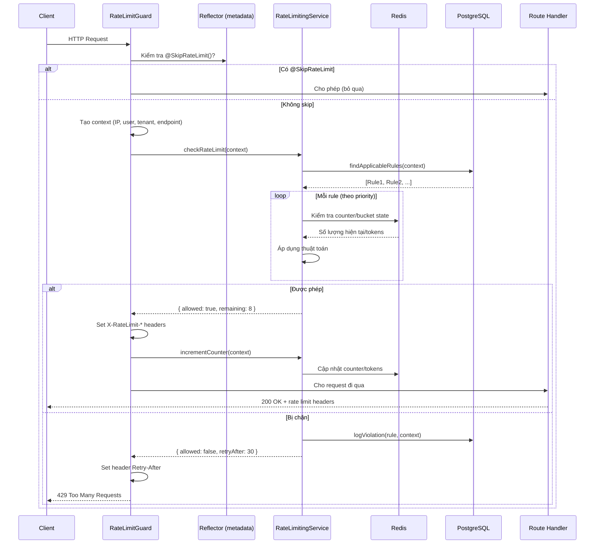
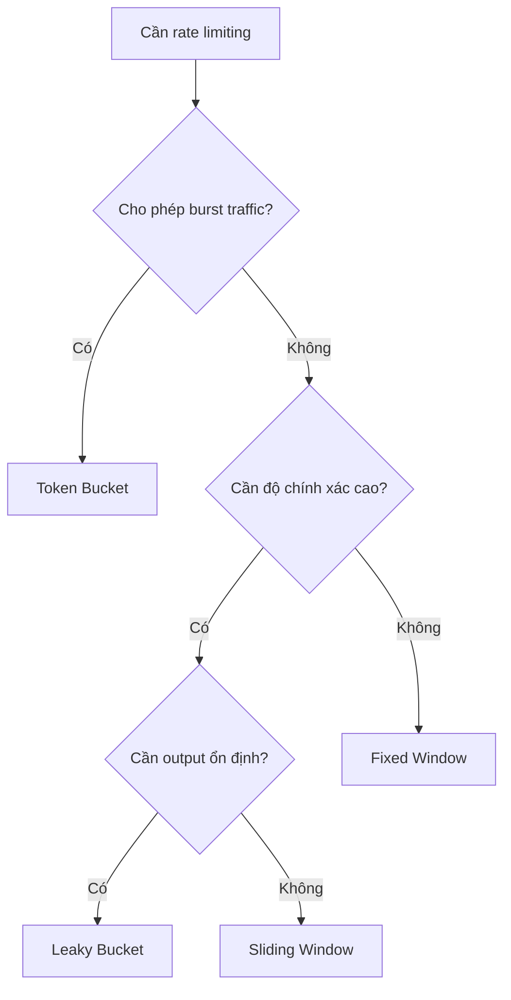
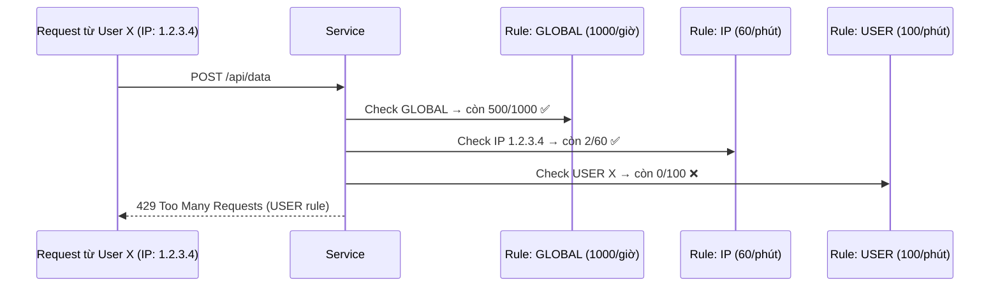
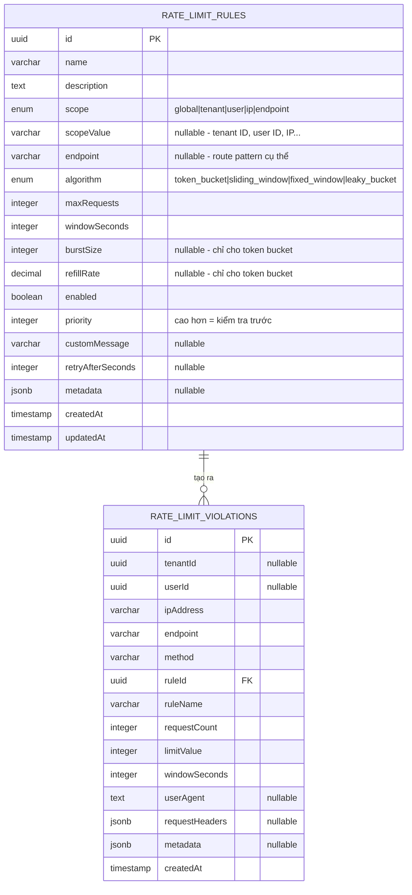

# Tài liệu Thiết kế: Rate Limiting Module

## 1. Tổng quan

Rate Limiting module bảo vệ backend khỏi việc bị lạm dụng, tấn công DDoS, và sử dụng quá mức bằng cách kiểm soát số lượng request mà client có thể gửi trong 1 khoảng thời gian. Module này được xây dựng như 1 shared NestJS module với Redis làm nơi lưu trạng thái, hỗ trợ 4 thuật toán chuẩn công nghiệp, và có thể giới hạn theo nhiều phạm vi (global, tenant, user, IP, endpoint).

**Vị trí source:** `apps/api-gateway/src/shared/rate-limiting/`

## 2. Kiến trúc

### 2.1 Cấu trúc thư mục

```
rate-limiting/
├── rate-limiting.module.ts            # Đăng ký NestJS module
├── rate-limiting.service.ts           # Logic chính + 4 thuật toán
├── rate-limiting.controller.ts        # REST API quản trị
├── guards/
│   └── rate-limit.guard.ts            # NestJS Guard (tự động áp dụng rate limit)
├── decorators/
│   └── rate-limit.decorator.ts        # @RateLimit(), @SkipRateLimit(), các preset có sẵn
├── entities/
│   ├── rate-limit-rule.entity.ts      # DB: cấu hình rule rate limit
│   └── rate-limit-violation.entity.ts # DB: log các lần vi phạm
└── dto/
    └── create-rate-limit-rule.dto.ts  # Validation cho input API
```

### 2.2 Các thành phần làm việc với nhau như thế nào



## 3. Lý thuyết: Các thuật toán Rate Limiting

### 3.1 Rate Limiting là gì?

Rate Limiting giống như bảo vệ ở cửa 1 quán bar. Quán có sức chứa tối đa. Khi đầy, người mới phải đợi. Các bảo vệ khác nhau sẽ có cách đếm và cho người vào khác nhau.

### 3.2 4 thuật toán

#### Fixed Window (Cửa sổ cố định)

**Khái niệm:** Chia thời gian thành các khoảng cố định (window). Đếm request trong mỗi window. Reset counter khi window kết thúc.

**Ví dụ thực tế:** Bãi đỗ xe reset số đếm mỗi giờ. Lúc 2:00 PM reset về 0, lúc 3:00 PM reset lại.

```
Window 1 (00:00-01:00)    Window 2 (01:00-02:00)
[||||||||..] 8/10          [|||.......] 3/10
             ↑ còn 2                    ↑ còn 7
                    ↑ counter reset tại đây
```

**Cách hoạt động trong code** (`checkFixedWindow`):

1. Tính window hiện tại: `currentWindow = floor(now / windowMs)`
2. Redis key: `ratelimit:{ruleId}:{scope}:{currentWindow}`
3. Lấy counter từ Redis → kiểm tra có < maxRequests không

**Ưu điểm:** Đơn giản, tốn ít bộ nhớ (1 Redis key mỗi window)
**Nhược điểm:** Vấn đề ranh giới — client có thể gửi gấp 2 lần request tại điểm giao 2 window:

```
Window 1: ....||||||| (10 request lúc 00:59)
Window 2: |||||||.... (10 request lúc 01:00)
= 20 request trong 2 giây, nhưng limit là 10/phút
```

**Phù hợp với:** Use case đơn giản, giới hạn đăng nhập (AUTH preset: 5 req/phút)

---

#### Sliding Window (Cửa sổ trượt)

**Khái niệm:** Thay vì ranh giới cố định, window "trượt" theo thời gian. Đếm request trong N giây gần nhất tính từ hiện tại.

**Ví dụ thực tế:** Nhà hàng nói "tối đa 10 người trong 60 phút gần nhất". Bất kỳ lúc nào, nó đếm tất cả người đã vào trong 1 giờ qua.

```
Thời gian: ──────[===========60s window===========]──────>
                          ↑ đếm request trong khoảng này
                   (request cũ hơn 60s bị xóa)
```

**Cách hoạt động trong code** (`checkSlidingWindow`):

1. Dùng Redis Sorted Set — mỗi request lưu với timestamp làm score
2. Xóa entry cũ: `ZREMRANGEBYSCORE key 0 (now - windowMs)`
3. Đếm còn lại: `ZCARD key`
4. Nếu count < maxRequests → cho phép

**Ưu điểm:** Không có vấn đề ranh giới, rate limit mượt mà
**Nhược điểm:** Tốn nhiều bộ nhớ hơn (lưu mỗi timestamp)

**Phù hợp với:** API rate limiting, public endpoint (STANDARD: 60 req/phút, API: 1000 req/giờ)

---

#### Token Bucket (Thùng token)

**Khái niệm:** Hình dung 1 cái thùng chứa token. Mỗi request tiêu thụ 1 token. Token được nạp lại với tốc độ cố định. Thùng có sức chứa tối đa (burst size).

**Ví dụ thực tế:** Vé xe bus có 10 lượt. Mỗi chuyến đi tiêu 1 lượt. Mỗi giờ được cộng thêm 2 lượt (tối đa 10).

```
Sức chứa: 10 tokens, nạp lại: 2 tokens/giây

Thời điểm 0:  [TTTTTTTTTT] 10 tokens  (đầy)
Burst:        [TTTT......] 4 tokens   (dùng 6 request)
Đợi 3 giây:  [TTTTTTTTTT] 10 tokens  (nạp lại: 4 + 2*3 = 10, giới hạn)
```

**Cách hoạt động trong code** (`checkTokenBucket`):

1. Redis lưu: `{ tokens: number, lastRefill: timestamp }`
2. Khi check: tính số token cần nạp dựa trên thời gian đã trôi qua
3. `tokens = min(burstSize, tokens + elapsed * refillRate)`
4. Nếu tokens >= 1 → cho phép, tiêu thụ 1 token

**Ưu điểm:** Cho phép burst traffic, tốc độ trung bình ổn định
**Nhược điểm:** State phức tạp hơn 1 chút

**Phù hợp với:** API cần chịu burst (RELAXED: 300 req/phút, BURST: 100 req/phút)

---

#### Leaky Bucket (Thùng rò)

**Khái niệm:** Request vào 1 cái thùng (hàng đợi). Thùng "rò" với tốc độ cố định. Nếu thùng đầy, request mới bị từ chối.

**Ví dụ thực tế:** 1 cái phễu. Bạn đổ nước vào (request). Nước nhỏ giọt với tốc độ cố định. Nếu đổ quá nhanh, phễu tràn (bị reject).

```
                Request vào
                    ↓
               ┌─────────┐
               │ Hàng đợi │ ← sức chứa = maxRequests
               │  |||     │
               └────┬────┘
                    ↓ tốc độ rò = maxRequests / windowSeconds
               Đã xử lý
```

**Cách hoạt động trong code** (`checkLeakyBucket`):

1. Redis lưu: `{ queueSize: number, lastLeak: timestamp }`
2. Khi check: tính số request đã "rò" dựa trên thời gian
3. `queueSize = max(0, queueSize - elapsed * leakRate)`
4. Nếu queueSize < maxRequests → cho phép, thêm 1 vào hàng đợi

**Ưu điểm:** Tốc độ output hoàn hảo ổn định, không burst
**Nhược điểm:** Nghiêm ngặt — không chịu burst

**Phù hợp với:** Cần throughput ổn định (xử lý thanh toán, API nhiều thao tác ghi)

### 3.3 So sánh thuật toán

| Thuật toán     | Chịu burst?              | Bộ nhớ                  | Độ chính xác | Độ phức tạp |
| -------------- | ------------------------ | ----------------------- | ------------ | ----------- |
| Fixed Window   | Không (vấn đề ranh giới) | Thấp (1 counter)        | Thấp         | Đơn giản    |
| Sliding Window | Không                    | Cao (lưu mỗi timestamp) | Cao          | Trung bình  |
| Token Bucket   | Có (tối đa burst size)   | Thấp (2 giá trị)        | Trung bình   | Trung bình  |
| Leaky Bucket   | Không (output ổn định)   | Thấp (2 giá trị)        | Cao          | Trung bình  |

### 3.4 Hướng dẫn chọn thuật toán



## 4. Scope: Ai bị Rate Limit?

Rule có thể nhắm vào các phạm vi khác nhau:

| Scope      | Ý nghĩa                  | Ví dụ                        |
| ---------- | ------------------------ | ---------------------------- |
| `GLOBAL`   | Tất cả request bất kể ai | 10000 req/phút cho toàn API  |
| `TENANT`   | Theo tổ chức/công ty     | Tenant A: 1000 req/giờ       |
| `USER`     | Theo user đã xác thực    | User X: 100 req/phút         |
| `IP`       | Theo địa chỉ IP          | 192.168.1.1: 60 req/phút     |
| `ENDPOINT` | Theo route cụ thể        | POST /auth/login: 5 req/phút |

Nhiều scope có thể áp dụng đồng thời. **Rule nghiêm ngặt nhất thắng** — nếu global cho phép nhưng IP bị chặn, request vẫn bị block.



## 5. Áp dụng thực tế

### 5.1 Dùng Guard (Tự động)

Đăng ký `RateLimitGuard` global hoặc theo controller:

```typescript
// Đăng ký global trong main.ts
app.useGlobalGuards(new RateLimitGuard(reflector, rateLimitingService));

// Hoặc theo controller
@Controller('users')
@UseGuards(RateLimitGuard)
export class UsersController { ... }
```

Guard tự động:

1. Lấy IP, user, tenant từ request
2. Query DB tìm rule phù hợp
3. Kiểm tra Redis counter
4. Set response headers (`X-RateLimit-Limit`, `X-RateLimit-Remaining`, `X-RateLimit-Reset`)
5. Trả về 429 nếu bị rate limit

### 5.2 Dùng Decorator

```typescript
// Bỏ qua rate limit cho admin routes
@SkipRateLimit()
@Controller('admin')
export class AdminController { ... }

// Dùng preset có sẵn (decorator chỉ lưu metadata, chưa kết nối với guard)
@RateLimit(RateLimitPresets.AUTH)  // 5 req/phút, fixed window
@Post('login')
async login() { ... }

@RateLimit(RateLimitPresets.STANDARD)  // 60 req/phút, sliding window
@Get('users')
async getUsers() { ... }
```

### 5.3 Tạo Rule qua API

```bash
# Tạo rule: 5 lần đăng nhập mỗi phút theo IP
curl -X POST http://localhost:3001/api/v1/rate-limiting/rules \
  -H "Content-Type: application/json" \
  -d '{
    "name": "Login Rate Limit",
    "scope": "ip",
    "endpoint": "/auth/login",
    "algorithm": "fixed_window",
    "maxRequests": 5,
    "windowSeconds": 60,
    "priority": 10,
    "customMessage": "Quá nhiều lần đăng nhập. Thử lại sau 1 phút.",
    "enabled": true
  }'

# Tạo rule global cho API
curl -X POST http://localhost:3001/api/v1/rate-limiting/rules \
  -H "Content-Type: application/json" \
  -d '{
    "name": "Global API Limit",
    "scope": "global",
    "algorithm": "sliding_window",
    "maxRequests": 10000,
    "windowSeconds": 3600,
    "priority": 1,
    "enabled": true
  }'
```

### 5.4 Theo dõi vi phạm

```bash
# Lấy tất cả vi phạm
GET /rate-limiting/violations?limit=50

# Lấy vi phạm theo IP cụ thể
GET /rate-limiting/violations?ipAddress=192.168.1.100

# Kiểm tra trạng thái rate limit của 1 IP
GET /rate-limiting/status/192.168.1.100?endpoint=/auth/login

# Reset rate limit cho 1 IP (ví dụ: sau khi xử lý hỗ trợ khách hàng)
POST /rate-limiting/reset
{ "ipAddress": "192.168.1.100" }
```

### 5.5 Response Headers

Mỗi response đều có thông tin rate limit:

```
HTTP/1.1 200 OK
X-RateLimit-Limit: 60          # Số request tối đa
X-RateLimit-Remaining: 45      # Số request còn lại trong window
X-RateLimit-Reset: 1708300800  # Unix timestamp khi window reset

# Khi bị rate limit:
HTTP/1.1 429 Too Many Requests
Retry-After: 30                # Số giây chờ đến khi có thể thử lại
X-RateLimit-Limit: 60
X-RateLimit-Remaining: 0
X-RateLimit-Reset: 1708300800
```

## 6. Data Model



## 7. Cấu trúc Redis Key

| Thuật toán     | Pattern Redis Key                       | Kiểu dữ liệu                                               |
| -------------- | --------------------------------------- | ---------------------------------------------------------- |
| Token Bucket   | `ratelimit:{ruleId}:{scope}`            | String: `{"tokens": 8, "lastRefill": 1708300000}`          |
| Sliding Window | `ratelimit:{ruleId}:{scope}:requests`   | Sorted Set: score=timestamp, member=`{timestamp}-{random}` |
| Fixed Window   | `ratelimit:{ruleId}:{scope}:{sốWindow}` | String: counter (số nguyên)                                |
| Leaky Bucket   | `ratelimit:{ruleId}:{scope}`            | String: `{"queueSize": 3, "lastLeak": 1708300000}`         |

Tất cả key có TTL = `windowSeconds * 2` để tự động dọn dẹp.

## 8. Bảng Preset tham khảo

| Preset       | Max Request | Window | Thuật toán     | Use Case                |
| ------------ | ----------- | ------ | -------------- | ----------------------- |
| `STRICT`     | 10          | 60s    | Sliding Window | Endpoint nhạy cảm       |
| `STANDARD`   | 60          | 60s    | Sliding Window | Sử dụng API bình thường |
| `RELAXED`    | 300         | 60s    | Token Bucket   | Endpoint traffic cao    |
| `API`        | 1000        | 3600s  | Sliding Window | Quota API theo giờ      |
| `BURST`      | 100         | 60s    | Token Bucket   | Endpoint cần chịu burst |
| `AUTH`       | 5           | 60s    | Fixed Window   | Đăng nhập/đăng ký       |
| `PUBLIC_API` | 100         | 3600s  | Sliding Window | API công khai           |

## 9. Câu hỏi mở

- Decorator `@RateLimit()` lưu metadata nhưng `RateLimitGuard` hiện tại chỉ đọc `@SkipRateLimit()`. Guard dùng rule từ DB thay vì config từ decorator. Guard có nên đọc cả config từ decorator không?
- `CacheKeyBuilders` trong caching module cũng có hạn chế tương tự — thiết kế cho service layer nhưng dùng ở controller layer. Cần xem xét thiết kế cho đồng nhất.
- Chưa có cơ chế warmup hoặc đồng bộ trạng thái rate limit giữa nhiều instance (horizontal scaling). Redis xử lý được điều này, nhưng chưa có phương án phục hồi khi Redis gặp sự cố.
